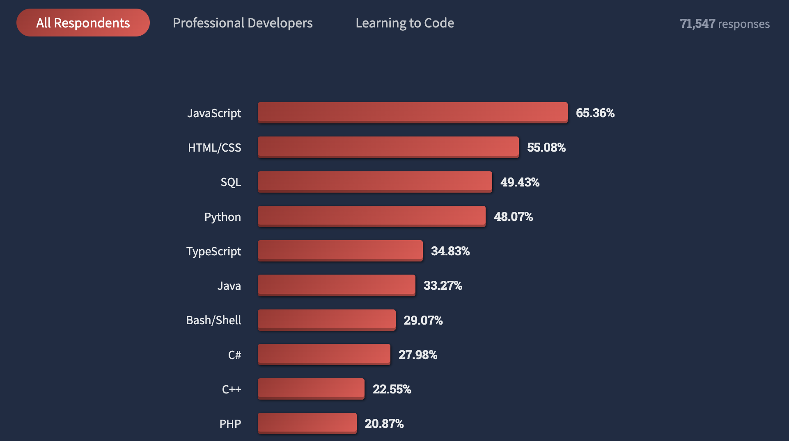
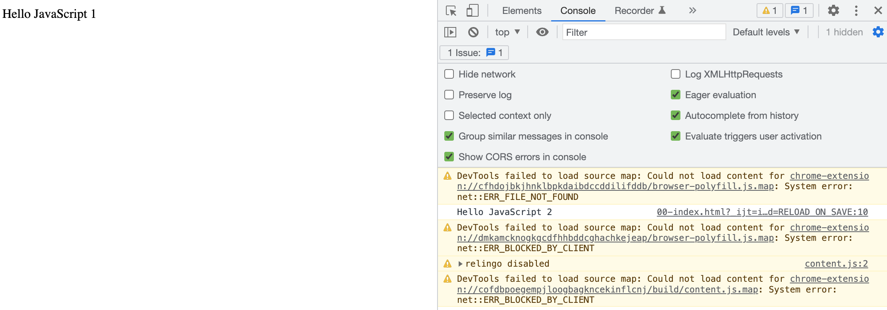

# JavaScript极简入门: 1. Hello JavaScript (2行代码)

WTF JavaScript 教程，帮助新人快速入门 JavaScript。

**推特**：[@WTFAcademy_](https://twitter.com/WTFAcademy_) ｜ [@0xAA_Science](https://twitter.com/0xAA_Science)

**WTF Academy社群：** [官网 wtf.academy](https://wtf.academy) | [WTF Solidity教程](https://github.com/AmazingAng/WTFSolidity) | [discord](https://discord.wtf.academy) | [微信群申请](https://docs.google.com/forms/d/e/1FAIpQLSe4KGT8Sh6sJ7hedQRuIYirOoZK_85miz3dw7vA1-YjodgJ-A/viewform?usp=sf_link)

所有代码和教程开源在github: [github.com/WTFAcademy/WTF-Javascript](https://github.com/WTFAcademy/WTF-Javascript)

-----

大家好，欢迎来到WTF JS教程。根据2022年[Stack Overflow社区年度调查显示](https://survey.stackoverflow.co/2022/#most-popular-technologies-language)，JavaScript已经连续十年成为最受开发者和学习者欢迎的一门编程语言。学习JavaScript不仅是普通web开发者的技能，同时也是全栈web3学习者的必备知识。新的一年，WTF学院也将由这一讲开始带来全新的JavaScript教程。



这一讲，我们介绍编程语言的分类，JavaScript的诞生，JavaScript的概述，并写第一个JavaScript程序：Hello JavaScript。

## 编程语言的分类

编程语言主要分为机器语言、汇编语言、高级语言。机器语言是机器能直接识别的程序语言和指令代码；汇编语言是用一些可编程器件的低级语言；高级语言是接近自然语言和数学公式的编程范式，可以让开发者更好的编写代码。目前，我们所写的绝大多数编程语言都属于高级语言，例如Solidity、JavaScript。

在高级语言中，又根据翻译为机器语言的方式不同分为编译型语言和解释型语言。编译型语言是指在程序被执行前，有一个专门的翻译过程，把程序编译为机器语言文件，常见的编译型语言有：C、C++、Rust等。解释性语言是指编写的程序不先进行预先编译，由解释器一行一行的解析执行，常见的解释型语言有：JavaScript、Python等。

## JavaScript的诞生

1994年12月，网景公司（Netscape）发布了Netscape Navigator 1.0浏览器。这个浏览器由于可以支持多媒体元素，所以在当时来看是一款比较成熟的浏览器。但与此同时，这款浏览器只支持HTML标记，不支持用户与浏览器之间发生交互。所以到了1995年，Netscape在其多媒体计划上新增了一个需求：增加交互性。

由于交互性不能仅仅使用HTML来完成，需要一种新的可嵌入到网页的脚本语言，来为网页带来额外的功能，并控制浏览器的行为。JavaScript就在这种时代背景和需求下诞生。

1995年4月，BrendanEich加入网景公司，并由他来设计一款可以运行在Netscape Navigator的一款脚本语言。BrendanEich花了十天的时间便设计出了这门“新语言”的最初版本，最初因为Java在当时很火，并且Java的图标是咖啡，所以Netscape公司最早将该脚本语言取名为Mocha（摩卡）。但由于商标原因，再加上当时Netscape公司的很多产品都是以“Live”作为产品名前缀，所以在1995年9月该脚本语言更名为LiveScript。

1995年12月，Netscape公司与Sun公司（Java语言的发明者）达成协议，正式将LiveScript改名为JavaScript，至此JavaScript语言诞生。

1996年3月，Netscape Navigator 2.0浏览器正式内嵌了JavaScript语言。

## JavaScript的概述

JavaScript可以在浏览器中运行，也可以在服务端运行。在浏览器中运行的JavaScript称为客户端JavaScript；在服务端运行的JavaScript成为服务端JavaScript，常见的服务端JavaScript环境包括Node.js。

浏览器环境下的JavaScript包括了以下几个部分：

- 核心标准（ECMAScript）
- 文档对象模型（DOM）
- 浏览器对象模型（BOM）

**ECMAScript：**

ECMAScript是一种由Ecma国际（前身为欧洲计算机制造商协会，European Computer Manufacturers Association）通过ECMA-262标准化的脚本程序设计语言，可以理解为JavaScript的标准。ECMAScript 经过许多版本的修改，删除和增加了许多特性。其中比较重要的是第六版，俗称 **ES6**、**ES2015**，正式支持了类、模块、迭代器、生成器、箭头函数、期约对象、反射、代理和众多新的数据类型。

**DOM：**

文档对象模型（Document Object Model, DOM）是一个应用编程接口，用于在 HTML 中使用扩展的 XML 。它将整个页面抽象为一组分层节点。例如下面的HTML页面：

```html
<html lang="zh">
  <head>
    <title>Document</title>
  </head>
  <body>
    <p>Hello World</p>
  </body>
</html>
```

可以抽象为如下分层节点：

```
html
|
|-heade
|    |-title
|        |-Document
|
|-body
|    |-p
|        |-Hello World
```

DOM 通过创建表示文档的树，让开发者可以随心所欲地控制网页的内容和结构。使用 DOM API 可以轻松地删除、添加、替换、修改节点。

**BOM:**

浏览器对象模型（Browser Object Model, BOM，常用于访问和操作浏览器的窗口。BOM由多个对象组成，其中代表浏览器窗口的Window对象是BOM的顶层对象，其他对象都是该对象的字对象。我们通常会将任何特定于浏览器的扩展都归于 BOM 的范畴，比如下面就是这样一些扩展：

- 弹出新浏览器窗口
- 移动、缩放和关闭浏览器窗口
- navigator 对象，提供浏览器的信息
- location 对象，提供浏览器加载页面的信息
- screen 对象，提供关于用户屏幕分辨率的信息
- performance 对象，提供浏览器内存占用、导航行为和时间统计的信息
- 对 cookie 的支持
- 其他自定义对象，如 XMLHttpRequest 和 IE 的 ActiveXObject

## Hello JavaScript

下面，我们要写第一个包含JavaScript的程序：Hello JavaScript，看看JavaScript是如何和HTML页面进行交互的。

```html
<!DOCTYPE html>
<html lang="en">
  <head>
    <meta charset="UTF-8">
    <title>WTF JavaScript</title>
  </head>
  <body>
    <script type="text/javascript">
      document.write('Hello JavaScript 1')
      console.log('Hello JavaScript 2')
    </script>
  </body>
</html>
```



在Hello JavaScript中，`type="text/javascript"`常作为`script`标签的属性，用于表示文本是属于JavaScript脚本，并通过`script`标签将JS代码内嵌至HTML页面中。`script`标签可以放入`<head>`中，也可以放入`body`中。由于普通的`script`标签（`script`标签没有async或defer属性）加载和解析是同步的，会阻塞DOM的渲染，所以对于普通的`script`标签一般建议放入`body`标签底部：

```html
<script type="text/javascript">
	...
</script>
```

`script`标签内为JS代码块，此例中有两行代码。第一行代码调用`document.write()`方法向文档中写入文本内容：Hello JavaScript 1；第二行代码调用`console.log()`方法在控制台输出文本内容: Hello JavaScript 2。

```js
document.write('Hello JavaScript 1')
console.log('Hello JavaScript 2')
```

## 总结

这一讲我们介绍了编程语言的分类，JavaScript的诞生，JavaScript的概述，并在最后写了第一个包含JavaScript的程序代码：Hello JavaScript。之后，我们会学习更多关于JavaScript的细节。
