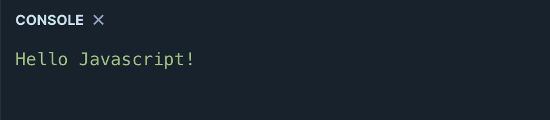
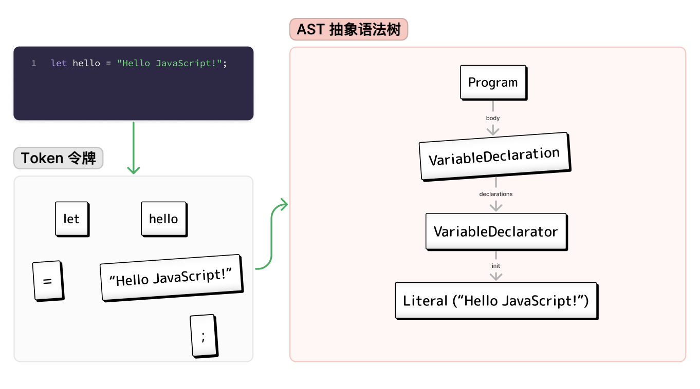

# JavaScript极简入门: 1. Hello JavaScript (2行代码)


**推特**：[@WTFAcademy_](https://twitter.com/WTFAcademy_) ｜ [@0xAA_Science](https://twitter.com/0xAA_Science)

**WTF Academy社群：** [官网 wtf.academy](https://wtf.academy) | [WTF Solidity教程](https://github.com/AmazingAng/WTFSolidity) | [discord](https://discord.wtf.academy) | [微信群申请](https://docs.google.com/forms/d/e/1FAIpQLSe4KGT8Sh6sJ7hedQRuIYirOoZK_85miz3dw7vA1-YjodgJ-A/viewform?usp=sf_link)

所有代码和教程开源在github: [github.com/WTFAcademy/WTF-JavaScript](https://github.com/WTFAcademy/WTF-Javascript)

-----

2023年，WTF学院将带来零基础入门的 WTF JavaScript 教程，帮助新人进入 Web3。第一讲，我们介绍编程语言的分类，JavaScript 概述，并写第一个JavaScript 程序（两行代码）：`Hello JavaScript`。

## 什么是 `Javascript`?

最初，JavaScript 是一种用于与网页元素交互的轻量型编程语言。前端开发者可以将它与 HTML/CSS 结合并增强网页的功能，例如填写表单，写博客。现在，JavaScript 也可以在服务器（后端）通过 Node.js 运行，可用于更新数据库、文件系统。

## 为什么要学习 `JavaScript`?

根据2022年[Stack Overflow社区年度调查显示](https://survey.stackoverflow.co/2022/#most-popular-technologies-language)，JavaScript 已经连续十年成为最受开发者和学习者欢迎的一门编程语言。学习 JavaScript 不仅是普通 web 开发者的技能，同时也是全栈 web3 学习者的必备知识。


## 开发工具

### 1. playcode.io


[playcode](https://playcode.io/)是一个在线编译`javascript`的平台，你不需要在本地安装任何人间就可以运行`.js`文件，非常方便。本教程将使用 playcode 进行代码演示，未来也将在 [wtf.academy]
(https://wtf.academy) 的教程中嵌入可互动代码模块。你可以在[链接](https://playcode.io/1051873)上找到这一讲的代码。


### 2. VScode

你可以使用本地 [VScode](https://code.visualstudio.com/download) 进行开发，需要安装[Node.js](https://nodejs.org/zh-cn/download/)。我们会在之后的章节介绍如何使用 `Node.js`。

## Hello JavaScript

下面，我们要写第一个 JavaScript 程序：`Hello JavaScript`。在这个程序中，我们定义了一个变量，然后将它的值输出到控制台。

代码:

```js
let hello = "Hello JavaScript!";
console.log(hello);
```

输出: 


下面，我们逐行学习一下。

1. 第 1 行中，我们利用 `let` 关键字定义了一个名为 `hello` 的变量，并将`"Hello JavaScript!"` 赋值给它，最后以分号 `;` 结束这一行命令。

  ```js
  let hello = "Hello JavaScript!";
  ```

2. 第 2 行中，我们利用内置函数 `console.log` 将 `hello` 变量的值转换成文本并输出到控制台，让我们可以看到。

  ```js
  console.log(hello);
  ```

## Javascript 程序是如何运行的?



如果说`编程语言`是人类与机器沟通的语言，那么`程序`是一篇篇文章，`代码`就其中的文本。Javascript 程序运行的大致步骤：

1. 程序员完成一段代码。
  ```js
  let hello = "Hello JavaScript!";
  ```
2. 将代码提交给`编译器`（compiler）编译。首先，`编译器`会将`代码`分解为单个的`令牌`（token）。上面的命令会被分解为 `5` 个令牌: `let`, `hello`, `=`, `"Hello JavaScript!"`, 和 `；`。

3. 接下来，`令牌`会被重新组织成一个树状结构，也叫`抽象语法树`（Abstract Syntax Tree, AST）。你可以在[AstExplorer](https://astexplorer.net/)上输入代码，并查看生成的`抽象语法树`。

4. 最后，编译器会将结构化的`抽象语法树`转换并生成计算机能运行的的`机器码`。

如果你的`代码`没有按照`编程语言`的语法来写，编译器就没有办法把它解析为机器能懂的`机器码`，`程序`就无法运行。这时，你就要去找出程序的`bug`并修复它。在未来的教程中，我们将介绍更多的 `JavaScript` 语法。

## 习题

将 `Hello Javascript` 程序中变量 `hello` 的值改为 `Hello WTF Academy`，并观察控制台的输出。

## 总结

这一讲我们介绍了编程语言的分类，JavaScript的诞生，JavaScript的概述，并在最后写了第一个包含JavaScript的程序代码：Hello JavaScript。之后，我们会学习更多关于JavaScript的细节。
