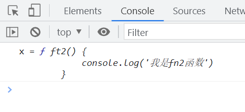

# WTF JavaScript 极简教程: 4. function

WTF JavaScript 教程，帮助新人快速入门 JavaScript。

**推特**：[@WTFAcademy_](https://twitter.com/WTFAcademy_) ｜ [@0xAA_Science](https://twitter.com/0xAA_Science)

**WTF Academy 社群：** [官网 wtf.academy](https://wtf.academy) | [WTF Solidity 教程](https://github.com/AmazingAng/WTFSolidity) | [discord](https://discord.wtf.academy) | [微信群申请](https://docs.google.com/forms/d/e/1FAIpQLSe4KGT8Sh6sJ7hedQRuIYirOoZK_85miz3dw7vA1-YjodgJ-A/viewform?usp=sf_link)

所有代码和教程开源在 github: [github.com/WTFAcademy/WTF-Javascript](https://github.com/WTFAcademy/WTF-Javascript)

---

这一讲，我们将介绍JS中的`function`，包括四种定义函数的语法、箭头函数、函数名、函数的参数和`this`。

## 四种定义函数的语法

下面我们以加法为例使用四种方法来定义具有相同功能的函数。

### 函数声明

```javascript
function sum(num1,num2){
    return num1 + num2
}
```

`function`表示函数，`sum`代表函数名，同时也是指向该函数的指针。

小括号中的`num1`、`num2`表示函数的两个参数，大括号中的语句表示函数体，也就是调用函数后要执行的代码。

`return`关键字指定函数的返回值，任何值都可以作为返回值。如果不写`return`或者只写`return`后面不跟任何值，就相当于`return undefined`。

如果函数体中存在`return`，那么函数执行到`return`就结束了，后面写再多语句也是无效的。

### 函数表达式

```javascript
let sum = function(num1,num2){
    return num1 + num2
}
```

函数表达式与函数声明几乎一样，唯一的区别就是与函数声明相比，`sum`被提到前面作为变量（也可以理解成指针）指向这个函数，该函数可以通过变量`sum`来引用。

`=`后边的函数我们把它称为`匿名函数`

### 箭头函数（arrow function）

```javascript
let sum = (num1,num2) => {
    return num1+num2
}
```

### Function构造函数

Function构造函数可以接收任意多个字符串参数，最后一个参数会被当成函数体，而前面的所有参数都是新函数的参数。

```javascript
let sum = new Function('num1','num2',"return num1 + num2")
```

由于这种语法有些繁琐，因此在实际开发中并不被推荐使用，学员了解即可。

## 箭头函数

ES6新增了使用`=>`语法来定义函数，这种语法比函数声明和函数表达式都更为简洁。

箭头函数如果只有一个参数，可以不使用小括号。只有在没有参数，或者有多个参数的情况下，才必须使用小括号：

```javascript
let add = x => {return x + 1} //只有一个参数
let getRandom = () =>{return Math.random()} //没有参数需要括号
let sum = (num1,num2) => {return num1 + num2} //多个参数需要括号
let sum = num1,num2 => {return num1 + num2} // 错误的写法
```

箭头函数的大括号也可以省略，如果不使用大括号，那么箭头后面就只能有一行代码，并且如果这行代码有值的话会被隐式返回

```javascript
let double = x => x * 2 //返回x的2倍
let print = x => console.log(x) //返回undefined
```

## 函数名

因为函数名就是指向函数的指针，因此一个函数可以有多个函数名：

```javascript
function sum1(num1,num2){
    return num1+num2
}

console.log(sum1(1,1)) //2

let sum2 = sum1
console.log(sum2(1,1)) //2
console.log(sum1 === sum2) //true

sum1 = null
console.log(sum2(1,1)) //2
```

在上面这段代码中，`sum1`和`sum2`存储的都是内存中该函数的地址，因此`sum1 === sum2`，并且将`sum1`清空后并不会影响`sum2`，`sum2`仍然指向该函数。

注意，使用不带括号的函数名会访问函数指针并返回该函数，带上括号后才会执行该函数。


## 函数的参数

函数的参数分为形参和实参。

### 形参

在下面这个函数中，`num1`是在定义函数时创建的形式参数（形参），并且`num1`会自动在函数内部声明但不会被赋值。

```javascript
function sum1(num1) {
    console.log('num1 =',num1) //num1 = undefined
}
```


### 实参

在调用函数时，可以通过函数的`()`传递任意数量的实参，实参会赋值给对应位置的形参并遵循以下规则：

1. 如果实参和形参数量一样，则实参和形参的值一一对应。
2. 如果实参比形参多，那么多余的实参不会被使用。
3. 如果形参比实参多，那么多余的形参为`undefined`，也就是未被赋值。


### 函数也可以作为参数

```javascript
function ft1(x) {
    console.log('x =',x)
}
function ft2(){
    console.log('我是fn2函数')
}
ft1(ft2)
```



函数作为参数最为典型的例子便是回调函数。

```javascript
  contractUSDT.on('Transfer', (from, to, value)=>{
    console.log(from, to, value)
  })
```

在上面这个例子中，`on`函数有两个参数，第一个是字符串`'Transfer'`，第二个是箭头函数。该函数保持对USDT合约的监听，一旦发生`Transfer`事件便会调用后续的箭头函数打印出`from`、`to`和`value`。

## this

函数中存在一个特殊的属性`this`，`this`存储的是一个对象，这个对象由函数调用方式来决定。

1. 当一个函数被当成一个对象的方法去调用时，`this`存储的就是这个对象。

```javascript
const obj = {
    sayHello:function(){
        console.log(this)
    }
}
obj.sayHello() // {sayHello：f}
```


2. 当一个函数被直接调用时，`this`存储的是`window`

```javascript
const sayHello = function(){
        console.log(this)
    }
sayHello()
```


## 总结

这一讲，我们具体介绍了JS中的`function`，包括四种定义函数的语法、箭头函数、函数名、函数的参数和`this`。箭头函数和函数表达式其实存在一些区别，学员可以自行探索一下。

## 参考资料

JavaScript高级程序设计（第4版）10 函数