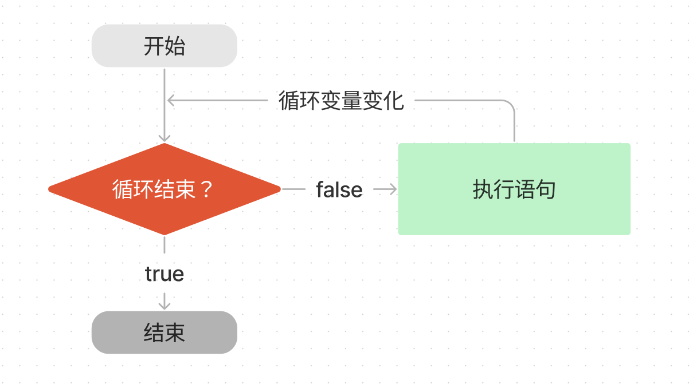
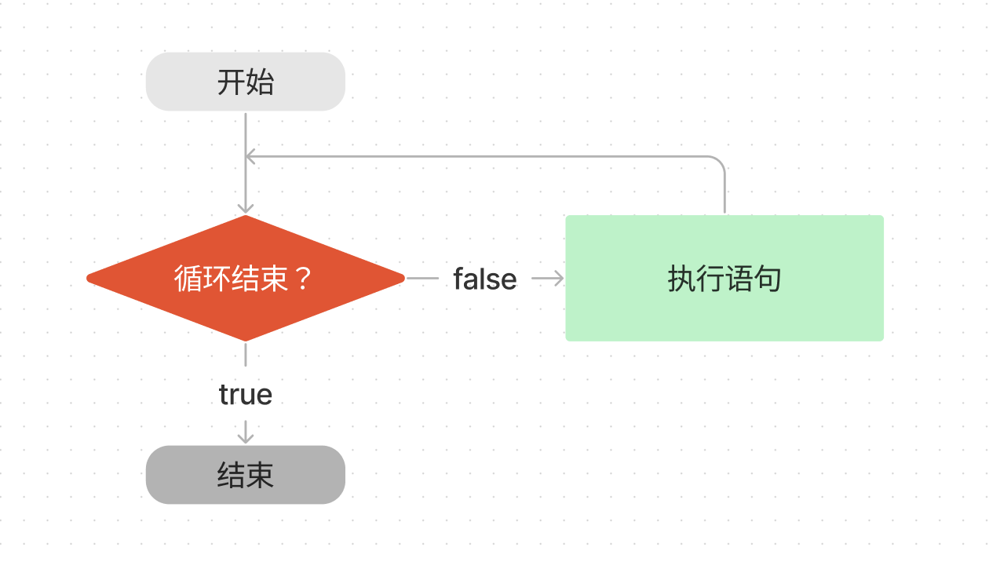
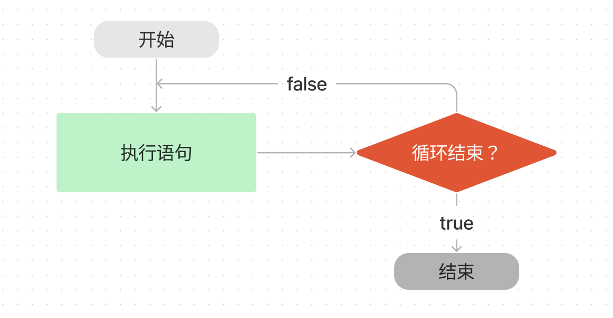

# WTF JavaScript 极简教程: 7. 循环语句

WTF JavaScript 教程，帮助新人快速入门 JavaScript。

**推特**：[@WTFAcademy\_](https://twitter.com/WTFAcademy_) ｜ [@0xAA_Science](https://twitter.com/0xAA_Science)

**WTF Academy 社群：** [官网 wtf.academy](https://wtf.academy/) | [WTF Solidity 教程](https://github.com/AmazingAng/WTFSolidity) | [discord](https://discord.gg/5akcruXrsk/) | [微信群申请](https://docs.google.com/forms/d/e/1FAIpQLSe4KGT8Sh6sJ7hedQRuIYirOoZK_85miz3dw7vA1-YjodgJ-A/viewform?usp=sf_link)

所有代码和教程开源在 github: [github.com/WTFAcademy/WTF-JavaScript](https://github.com/WTFAcademy/WTF-JavaScript)

---

我们经常需要重复执行一些操作，比如将列表中的商品逐个输出。这一讲，我们将介绍 JavaScript 中的循环语句，让程序重复执行某些操作。


## for 循环



`for` 循环是最常使用的循环形式，它可以指定循环的起点、终点和终止条件。其基本结构如下：

```js
for (循环变量初始化; 循环结束条件; 增量表达式) {
  执行语句
}
```

其中

- 循环变量初始化：初始化循环计数器，比如我们初始化一个变量来记录循环次数  `let i = 0`。
- 循环结束条件：它是一个表达式，用于判断是否结束循环。每轮循环开始时，都会计算这个条件表达式的值，若为 `true`，才继续进行循环；否则停止循环。比如，我们让循环十次，即 `i < 10`。
- 增量表达式：每轮循环执行的最后一个操作，通常用来更新循环变量。一般会将循环变量加一 `i++`。
- 执行语句: 每次循环重复的动作。比如打印出当前 `i` 的值。

下面是循环打印 `i` 的代码：

```js
for (let i = 0; i < 10; i++) {
  console.log(`i 当前的值为：${i}`);
}

// i 当前的值为：0
// i 当前的值为：1
// ...
// i 当前的值为：9
```


## while 循环



`while` 语句包括一个循环条件和一段代码块，每次循环会先检查循环条件，若为 `ture`，就继续执行代码块。它的基本结构如下：

```js
while (条件) {
  语句
}
```

与 `for` 循环相比，它没有循环变量及其自增，需要在语句中自己定义。我们将上面的例子改写为 `while` 循环：

```js
let i = 0
while (i < 10) {
  console.log(`i 当前的值为：${i}`)
  i++
}
```

## do-while 循环



`do-while` 循环与 `while` 循环类似，唯一的不同在于`do-while`  循环会首先执行循环体，然后检查条件，当条件为 `true`，重复执行循环体。其基本结构如下：

```js
do {
  语句
} while (条件)
```

这种结构的特点是不管条件是否为真，循环体至少执行一次。将前面 `while` 循环中打印 `i` 的例子改成 `do-while` 循环如下：

```js
let i = 0
do {
  console.log(`i 当前的值为：${i}`);
  i++;
} while (i < 9)
```

> 思考一下为什么这里的条件是 `i < 9` 而不是 `i < 10`？如果改为 `i < 10`，结果会有什么变化？

## break 语句

`break` 语句用于跳出代码块或循环。

下面的例子只会执行两次循环，当 `i` 等于 2 时，就会跳出循环：

```js
for (let i = 0; i < 3; i++) {
  console.log(`i 当前的值为：${i}`);
  if (i === 2) break;
}

// i 当前的值为：0
// i 当前的值为：1
// i 当前的值为：2
```

## continue 语句

`continue` 语句也用于跳出循环，与 `break` 语句不同的是，它不会中止整个循环，只会终止本轮循环，然后返回循环结构的头部，开始下一轮循环。

下面的代码会打印 10 以内的奇数：

```js
for (let i = 0; i < 10; i++) {
  if (i % 2 === 0) continue
  console.log(`i 当前的值为：${i}`)
}
// i 当前的值为：1
// i 当前的值为：3
// i 当前的值为：5
// i 当前的值为：7
// i 当前的值为：9
```

## 习题

补全下面的 `sum` 函数，完成逻辑: 返回从 1 到正整数 `num` 所有数的和。比如 `num` 为 5 时，返回 15.

```js
function sum(num) {
  
}

console.log(sum(5)) // 应该返回 15
console.log(sum(9)) // 应该返回 45
```

## 总结

这一讲我们介绍了 JavaScript 的循环语句，主要介绍了 `for` 和 `while` 两种循环结构，以及跳出循环的方法。
