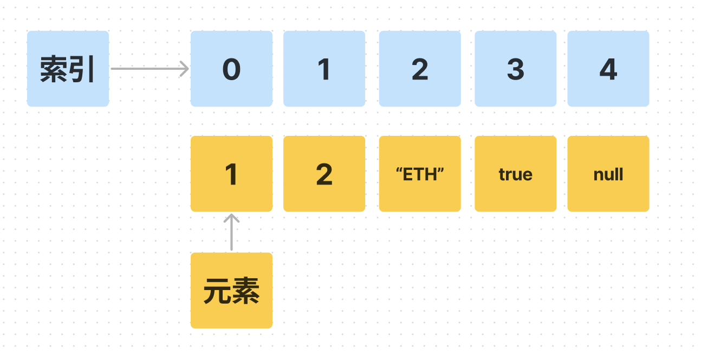
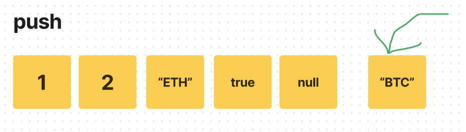
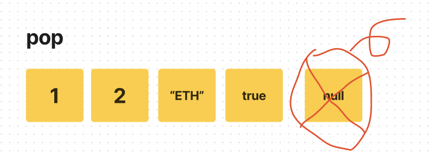

# WTF JavaScript 极简教程: 8. 数组

WTF JavaScript 教程，帮助新人快速入门 JavaScript。

**推特**：[@WTFAcademy_](https://twitter.com/WTFAcademy_) ｜ [@0xAA_Science](https://twitter.com/0xAA_Science)

**WTF Academy 社群：** [官网 wtf.academy](https://wtf.academy/) | [WTF Solidity 教程](https://github.com/AmazingAng/WTFSolidity) | [discord](https://discord.gg/5akcruXrsk/) | [微信群申请](https://docs.google.com/forms/d/e/1FAIpQLSe4KGT8Sh6sJ7hedQRuIYirOoZK_85miz3dw7vA1-YjodgJ-A/viewform?usp=sf_link)

所有代码和教程开源在 github: [github.com/WTFAcademy/WTF-Javascript](https://github.com/WTFAcademy/WTF-Javascript)

---
这一讲，我们会介绍 Javascript 最常见的复杂类型：数组（Array)。它可以把多个数据有序的存储在一起。

## 定义

数组类型支持在单个变量名下存储多个元素。创建数组最简单的方式，就是在一对中括号 `[]` 内部用逗号 `,` 分割的列表，例如：

```js
// 没有元素的空数组
const empty = [];
// 存储三个字符串的数组
const courses = ["Solidity", "Etherjs", "JavaScript"];
// 存储不同数据类型的数组
const mix = [1,'WTF',true];
```

数组中的元素可以使基础类型，也可以是另外一个数组。你可以通过数组存储比较复杂的嵌套数据。下面，`complex` 数组包含了 `courses` 和 `mix` 两个数组：

```js
// complex是一个数组，包含两个元素，每个元素都是另外一个数组
const complex = [courses, mix];
const nested = [[1, 2], [1, 1, 1]];
```

## 读写数组



### 读取

我们可以在变量上使用索引（中括号 `[]`）来读取数组元素。注意数组的索引是从 0 开始计算的：

```js
const arr = [1,2,3,["Solidity",true]]
// 读取第 0 个元素
console.log(arr[0])  // 1
// 读取嵌套数组第 0 个元素
console.log(arr[3][0]) // "Solidity"
```

### 写入

你可以利用索引对某个元素进行赋值，从而修改数组：

```js
// 修改数组的第1个元素
arr[1] = 6
console.log(arr) //[1, 6, 3, Array(2)]
```

数组变量还有一些属性可以读取，例如 `length` 属性会返回数组的长度：

```js
// 输出数组长度
console.log(arr.length) // 4
```

## 遍历数组

一个数组存储着多个数据，我们可以用循环来遍历数组内部的所有元素。下面的例子中，我们使用 for 循环来计算 `numArr` 数组的平均值。

```js
const numArr = [5, 8, 9, 11, 55];
let average = 0;
for(let i = 0; i < numArr.length; i++){
  average += numArr[i] / numArr.length
}
console.log(`平均值为: ${average}`) // 17.6
```

## 增加和删除

数组中内置了很多方法，其中 `push`, `pop` 用于增加，删除元素。

### push



数组中我们可以使用 `push` 方法在数组最后 `推入` （新增）一个元素。这个方法会使数组长度加一。

```js
const nums = [1,2,3]
nums.push(4)
console.log(nums) // [1, 2, 3, 4]
```

### pop



我们可以使用 `pop` 方法从数组的末尾 `弹出` 一个元素。这个方法会使数组长度减一，同时返回被弹出的元素。

```js
// pop方法会返回被弹出的元素
const last = nums.pop()
console.log(last) // 4  弹出
console.log(nums) // [1, 2, 3]
```

更多的数组操作方法可以参考 [MDN教程](https://developer.mozilla.org/zh-CN/docs/Web/JavaScript/Reference/Global_Objects/Array#%E5%AE%9E%E4%BE%8B%E6%96%B9%E6%B3%95)，可以着重看一下 `slice`, `splice`, `indexOf` 方法。

## 习题
补全下面的 `sumOdd` 函数，完成逻辑: 计算输入数组 `arr` 中所有奇数的和。

```js
function sumOdd(arr){

}

console.log(sumOdd([1, 2, 3, 4, 5])) // 应该返回 9
console.log(sumOdd([2, 4, 6, 8, 10])) // 应该返回 30
console.log(sumOdd([1, 3, 5, 7, 9])) // 应该返回 25
```

## 总结

这一讲我们介绍了 Javascript 中的数组，包括数组的定义，读取，写入，和遍历。数组是日常开发中经常用到的数据结构，我们将在后续的教程不断见到，一定要好好掌握。