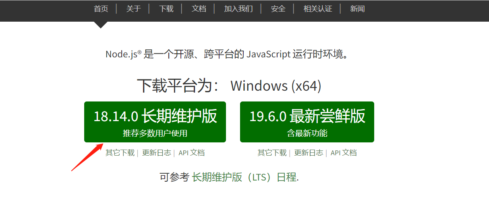
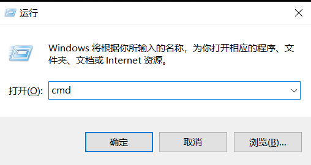
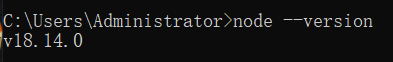
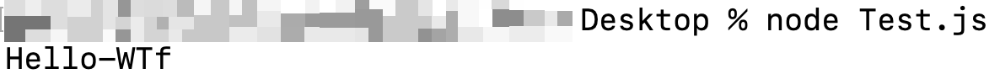

# WTF JavaScript 极简教程: 9. Node入门

WTF JavaScript 教程，帮助新人快速入门 JavaScript。

**推特**：[@WTFAcademy_](https://twitter.com/WTFAcademy_) ｜ [@0xAA_Science](https://twitter.com/0xAA_Science)

**WTF Academy 社群：** [官网 wtf.academy](https://wtf.academy/) | [WTF Solidity 教程](https://github.com/AmazingAng/WTFSolidity) | [discord](https://discord.wtf.academy/) | [微信群申请](https://docs.google.com/forms/d/e/1FAIpQLSe4KGT8Sh6sJ7hedQRuIYirOoZK_85miz3dw7vA1-YjodgJ-A/viewform?usp=sf_link)

所有代码和教程开源在 github: [github.com/WTFAcademy/WTF-Javascript](https://github.com/WTFAcademy/WTF-Javascript)

---

## 什么是Node?
Node全称是Node.js。在[Node 官网](https://nodejs.org/zh-cn/)中文首页是这么介绍Node.js的。Node.js是一个开源，跨平台的JavaScript运行时环境。
### 什么是JavaScript运行时环境？
就是指可以运行JavaScript的一种平台，比如你在电脑的txt中写了一段JavaScript代码，但是并不能运行，得不到你想要的结果。你得把他粘贴到Chrome中的控制台中，然后回车就可以拿到你想要的结果。这时候Chorme就是JavaScript的运行环境。或者把txt文件的后缀改成.js。然后打开终端输入xxx.js，也可以拿到你想要的运行结果。这时候Node就是JavaScript的运行环境。
## 安装Node.js
#### Mac版本
1.打开[Node.js官网](https://nodejs.org/zh-cn/)，如果官网打不开，可以访问国内[Node.js中文网](http://nodejs.cn/download/).下载Mac对应的pkg包即可。


#### Win版本
1.打开[Node.js官网](https://nodejs.org/zh-cn/)，如果官网打不开，可以访问国内[Node.js中文网](http://nodejs.cn/download/).下载Win对应的exe包即可。



#### 如何确认自己是否安装成功Node.js?
1. 如果是Mac那就打开Terminal,输入如下命令

```js
node -v
```
看到如下结果，就是安装成功了。


如果是Win系统，那就打开CMC.输入如下命令
```js
node --version
```

看到如下结果，就是安装成功了。


2. 此时我们在桌面创建一个Test.js的文本文件，然后用文本编辑器打开。
将如下代码复制进去
```js
console.log("Hello-WTF");
```
3. Mac系统使用cd命令进入Test.js所在的文件夹。
```js
//Mac系统命令
cd ~/Desktop/
//Win系统命令
cd desktop
```
4. 使用如下的Node命令运行Test.js文件
```js
node Test.js
```
5. 效果如下图所示

## 习题
将 `Hello-WTF` 程序中变量 `WTF` 的值改为 `“ WTF Academy!”`，并观察控制台的输出。
