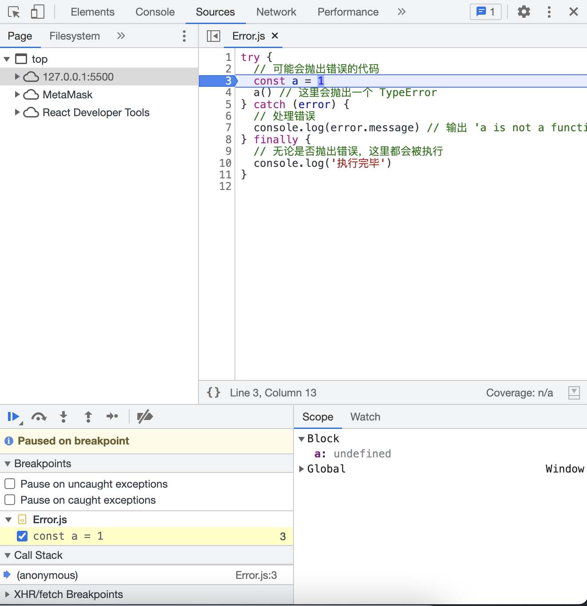

# WTF JavaScript 极简教程 18. 异常处理

WTF JavaScript 教程，帮助新人快速入门 JavaScript。

**推特**：[@WTFAcademy_](https://twitter.com/WTFAcademy_) ｜ [@0xAA_Science](https://twitter.com/0xAA_Science)

**WTF Academy 社群：** [官网 wtf.academy](https://wtf.academy/) | [WTF Solidity 教程](https://github.com/AmazingAng/WTFSolidity) | [discord](https://discord.gg/5akcruXrsk/) | [微信群申请](https://docs.google.com/forms/d/e/1FAIpQLSe4KGT8Sh6sJ7hedQRuIYirOoZK_85miz3dw7vA1-YjodgJ-A/viewform?usp=sf_link)

所有代码和教程开源在 github: [github.com/WTFAcademy/WTF-Javascript](https://github.com/WTFAcademy/WTF-Javascript)

---

在 JavaScript 编程中，错误处理和调试是必备的技能。无论你的代码编写得多么完美，错误总是难以避免的。JavaScript 提供了一套完善的错误处理机制，我们可以通过它来处理运行时的错误。在这一章节中，我们将介绍JavaScript 中的错误处理机制，以及如何使用浏览器的开发者工具调试程序。

## JavaScript 错误对象

JavaScript 有一种特殊的对象类型，名为 `Error`，它用于表示在程序执行过程中发生的错误。当 JavaScript 引擎遇到错误时，会抛出一个 `Error` 对象。

`Error` 对象包含两个主要的属性：`name` 和 `message`。`name` 属性表示错误的名称，`message` 属性则包含了错误的详细信息。

创建 `Error` 对象的语法如下：

```javascript
let error = new Error("This is an error message");
console.log(error.name); // "Error"
console.log(error.message); // "This is an error message"
```

## 抛出错误

在 JavaScript 中，我们可以使用 `throw` 关键字来手动抛出一个错误。当我们抛出一个错误时，程序的执行会立即停止，JavaScript 引擎会寻找处理这个错误的代码。如果没有找到任何错误处理代码，程序就会完全停止执行。

```javascript
throw new Error("This is an error message");
console.log("This will not be logged"); // 该行代码不会被执行
```

## 捕获错误

JavaScript 提供了 `try...catch` 语句来捕获和处理错误。在 `try` 块中的代码发生错误时，控制流会立即跳到对应的 `catch` 块。

```javascript
try {
  // 可能会抛出错误的代码
  const a = 1
  a() // 这里会抛出一个 TypeError
} catch (error) {
  // 处理错误
  console.log(error.message) // 输出 'a is not a function'
}
```

在这个例子中，我们在 `try` 块中抛出了一个错误，然后在 `catch` 块中捕获并处理了这个错误。

## finally 语句

`try...catch` 结构还可以包含一个 `finally` 块。无论 `try` 块中的代码是否抛出错误，`finally` 块中的代码总是会被执行。

```javascript
try {
  // 可能会抛出错误的代码
  const a = 1
  a() // 这里会抛出一个 TypeError
} catch (error) {
  // 处理错误
  console.log(error.message) // 输出 'a is not a function'
} finally {
  // 无论是否抛出错误，这里都会被执行
  console.log('执行完毕')
}
```

在上面的例子中，无论 `try` 块中的代码是否抛出错误，`finally` 块中的代码总是会被执行。

## 调试：浏览器的开发者工具

大部分的浏览器都有内置的开发者工具，你可以使用它们来调试你的 JavaScript 代码。开发者工具提供了许多强大的功能，包括断点、单步执行、查看变量值等等。

你可以通过以下步骤来打开开发者工具：

### 快捷键
`F12` （笔记本用户使用 `Fn+F12`）

### 手动打开

1. 打开浏览器。
2. 右键点击网页，选择 “检查” 或 “审查元素”。
3. 切换到 “Console” 或 “Sources” 标签。

在开发者工具中，你可以查看到所有的 JavaScript 错误，包括错误的类型、错误的信息，以及错误发生的位置。



你还可以在代码中的任何位置设置断点。当代码执行到断点的时候，它将会暂停，你可以查看变量的值，或者单步执行代码。

## 总结

在本教程中，我们详细介绍了 JavaScript 中的错误处理机制，包括如何创建和抛出错误，以及如何捕获和处理错误。当我们编写 JavaScript 代码时，应该时刻考虑错误处理，并编写适当的代码来处理可能出的错误。另外，我们还可以借助浏览器的开发者工具来调试我们的代码。
