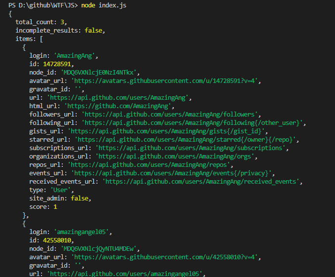

# WTF JavaScript 极简教程 22. 网络请求

WTF JavaScript 教程，帮助新人快速入门 JavaScript。

**推特**：[@WTFAcademy_](https://twitter.com/WTFAcademy_) ｜ [@0xAA_Science](https://twitter.com/0xAA_Science)

**WTF Academy 社群：** [官网 wtf.academy](https://wtf.academy/) | [WTF Solidity 教程](https://github.com/AmazingAng/WTFSolidity) | [discord](https://discord.gg/5akcruXrsk/) | [微信群申请](https://docs.google.com/forms/d/e/1FAIpQLSe4KGT8Sh6sJ7hedQRuIYirOoZK_85miz3dw7vA1-YjodgJ-A/viewform?usp=sf_link)

所有代码和教程开源在 github: [github.com/WTFAcademy/WTF-Javascript](https://github.com/WTFAcademy/WTF-Javascript)

---

在这一章节，我们将讨论如何使用 JavaScript 发送网络请求。重点关注 GET 和 POST 请求，并介绍如何使用 AJAX，Fetch API 和 axios 发送这些请求。

## GET 请求

GET 请求是最常见的 HTTP 请求类型，通常用于获取服务器上的数据。

在 JavaScript 中，可以使用 `fetch` 函数发送 GET 请求，如下例所示：

```javascript
fetch('https://api.github.com/search/users?q=amazingang', {
  method: 'GET',
})
.then(response => response.json())
.then(data => console.log(data))
.catch((error) => console.error('Error:', error));
```

在上述代码中，我们使用 `fetch` 函数向 URL `https://api.github.com/search/users?q=amazingang` 发送了一个 GET 请求。然后，我们使用 `.then` 来处理返回的响应并将其转换为 JSON 格式。最后，我们打印出返回的数据或捕获并打印出任何错误。

## POST 请求

POST 请求用于向服务器发送数据。这种请求类型通常用于提交表单。

发送 POST 请求与发送 GET 请求类似，但是需要在 `fetch` 函数的第二个参数中提供一些额外的选项。具体来说，我们需要设置 `method` 为 `'POST'`，并提供一个 `body`，该 `body` 包含我们要发送的数据。

以下是一个示例：

```javascript
fetch('https://api.example.com/data', {
  method: 'POST',
  headers: {
    'Content-Type': 'application/json',
  },
  body: JSON.stringify({
    username: '0xAA',
    password: 'pwd',
  }),
})
.then(response => response.json())
.then(data => console.log(data))
.catch((error) => console.error('Request failure:', error));
```

在上述代码中，我们向同样的 URL 发送了一个 POST 请求，但是这次我们包含了一个请求体，该请求体包含 `username` 和 `password` 两个字段的 JSON 数据。请注意，我们也设置了 `Content-Type` 头部为 `application/json`，以告诉服务器我们正在发送 JSON 数据。

## AJAX

AJAX（Asynchronous JavaScript and XML）是一种在无需刷新整个页面的情况下，与服务器交换数据并更新部分网页的技术。AJAX 不是一种新的编程语法，而是使用已有的标准，如 XMLHttpRequest 对象，组合在一起的一种新方式。

以下是一个 AJAX 的例子：

```javascript
// 创建 XMLHttpRequest 对象
let xhr = new XMLHttpRequest();

// 指定请求的方法和 URL
xhr.open("GET", 'https://api.github.com/search/users?q=amazingang', true);

// 设置回调函数，处理请求的响应
xhr.onreadystatechange = function () {
  // 请求成功
  if (xhr.readyState == 4 && xhr.status == 200)
    // 处理响应数据
    console.log(JSON.parse(xhr.responseText));
}
// 发送请求
xhr.send();
```

在浏览器的console中执行以上代码，会打印出名字中包含`amazingang`的github用户


## Fetch API

Fetch API 提供了一种简单、合理的方式来跨网络异步获取资源。它比旧的 XMLHttpRequest 接口更加强大和灵活。Fetch API 返回一个 Promise 对象，表示一个异步操作的最终完成（或失败）及其结果的值。

以下是一个 Fetch API 的例子：

```javascript
fetch('https://api.github.com/search/users?q=amazingang')
  .then(response => response.json())
  .then(data => console.log(data))
  .catch(error => console.error('Error:', error));
```


## Axios

Axios 是一个基于 Promise 的 HTTP 库，可以用在浏览器和 node.js 中。Axios 的主要特点包括：可以拦截请求和响应，转换请求和响应数据，取消请求，自动转换 JSON 数据，客户端支持防御 XSRF 等。

以下是一个 axios 的例子：

```javascript
const axios = require('axios');

axios.get('https://api.github.com/search/users?q=amazingang')
  .then(function (response) {
    console.log(response.data);
  })
  .catch(function (error) {
    console.log(error);
  });
```



## 总结

以上是 AJAX，Fetch API 和 axios 的简单介绍。在实际开发中，你可以根据你的需求和场景，选择最适合你的技术进行网络请求。
