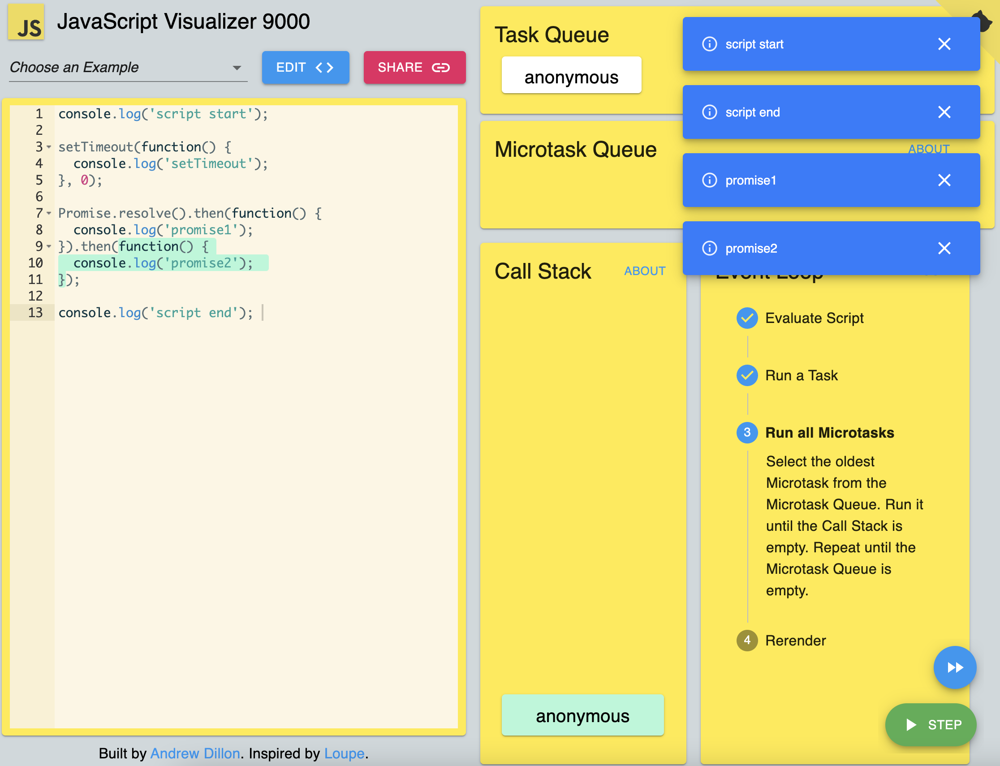

# WTF JavaScript 极简教程 23. 事件循环

WTF JavaScript 教程，帮助新人快速入门 JavaScript。

**推特**：[@WTFAcademy_](https://twitter.com/WTFAcademy_) ｜ [@0xAA_Science](https://twitter.com/0xAA_Science)

**WTF Academy 社群：** [官网 wtf.academy](https://wtf.academy/) | [WTF Solidity 教程](https://github.com/AmazingAng/WTFSolidity) | [discord](https://discord.gg/5akcruXrsk/) | [微信群申请](https://docs.google.com/forms/d/e/1FAIpQLSe4KGT8Sh6sJ7hedQRuIYirOoZK_85miz3dw7vA1-YjodgJ-A/viewform?usp=sf_link)

所有代码和教程开源在 github: [github.com/WTFAcademy/WTF-Javascript](https://github.com/WTFAcademy/WTF-Javascript)

---

尽管 JavaScript 是单线程的编程语言，但是它可以通过事件循环机制处理并发操作，使 JavaScript 能够进行异步处理。JavaScript 将代码分为同步任务和异步任务，通过事件循环，异步任务在等待（如网络请求）期间不会阻塞主线程，可以同时执行其他任务。

## 调用栈和任务队列

在我们深入研究事件循环之前，我们需要理解以下两个概念：

- **调用栈（Call Stack）**：JavaScript只有一个调用栈，用于在代码执行时跟踪函数调用的位置。当函数被调用时，它被添加到堆栈的顶部。当函数返回时，它从堆栈中被移除。同步任务会直接进入调用栈。

- **任务队列（Task Queue）**：当异步任务（如setTimeout或fetch）完成时，它们的回调函数被添加到任务队列中。如果调用栈为空，事件循环会将这些回调函数一个接一个地移到调用栈中以便执行。


## 宏任务和微任务

在 JavaScript 的事件循环机制中，任务被分为两种类型：宏任务和微任务。

- **宏任务（Macrotask）**：由 JavaScript 引擎线程直接执行的任务，包括整个脚本（main script），setTimeout 和 setInterval 的回调，setImmediate（Node.js环境）等。

- **微任务（Microtask）**：微任务是在当前宏任务结束后立即执行的任务，包括 Promise 的 then 和 catch 的回调，process.nextTick（Node.js环境），MutationObserver的回调（浏览器环境）等。

## 事件循环过程

事件循环的过程可以简化为以下

几个步骤：

1. 从宏任务队列中取出一个任务来执行。
2. 执行完这个任务后，执行所有的微任务。
3. 当微任务队列清空后，进入下一次事件循环，执行下一个宏任务。

来看一个例子，展示了宏任务和微任务的执行顺序：

```javascript
console.log('script start');  // Macrotask

setTimeout(function() {
  console.log('setTimeout');  // Macrotask
}, 0);

Promise.resolve().then(function() {
  console.log('promise1');  // Microtask
}).then(function() {
  console.log('promise2');  // Microtask
});

console.log('script end');  // Macrotask
```

上述代码的输出顺序为：

```js
script start
script end
promise1
promise2
setTimeout
```

解释：
1. 首先，代码执行到`console.log('script start')`，输出 "script start"。
2. 然后，遇到`setTimeout`，将其回调函数推入宏任务队列中。
3. 接着，遇到`Promise.resolve().then()`，将第一个`then`回调函数推入微任务队列中。
4. 继续执行，遇到第二个`then`回调函数，将其推入微任务队列中。
5. 执行到`console.log('script end')`，输出 "script end"。
6. 当前宏任务（script主线程代码）执行完毕，事件循环开始处理微任务队列，按顺序执行微任务。
7. 执行第一个微任务，输出 "promise1"。
8. 执行第二个微任务，输出 "promise2"。
9. 微任务执行完毕，事件循环开始处理下一个宏任务。
10. 从宏任务队列中取出`setTimeout`的回调函数，输出 "setTimeout"。

建议你在 [jsv9000](https://www.jsv9000.app/) 网站上体验一下事件循环的可视化，可以更直观的理解事件循环的过程。



## 总结

在这一讲，我们深入学习了 JavaScript 中的事件循环，包括宏任务和微任务。这是理解 JavaScript 异步编程的基础，能帮助我们更好地理解和控制代码的执行顺序。