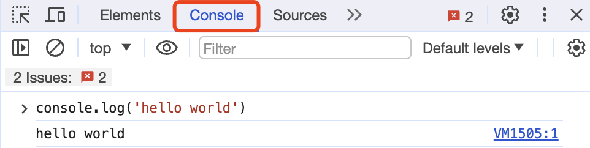

# JavaScript Minimalist Introduction: 1. Hello JavaScript (2 lines of code)

WTF JavaScript tutorial, helping beginners to quickly get started with JavaScript.

**Twitter**: [@WTFAcademy_](https://twitter.com/WTFAcademy_) | [@0xAA_Science](https://twitter.com/0xAA_Science)

**WTF Academy Community**: [Official Website wtf.academy](https://wtf.academy) | [WTF Solidity Tutorial](https://github.com/AmazingAng/WTFSolidity) | [Discord](https://discord.gg/5akcruXrsk) | [WeChat Group Application](https://docs.google.com/forms/d/e/1FAIpQLSe4KGT8Sh6sJ7hedQRuIYirOoZK_85miz3dw7vA1-YjodgJ-A/viewform?usp=sf_link)

All code and tutorials are open source on GitHub: [github.com/WTFAcademy/WTF-JavaScript](https://github.com/WTFAcademy/WTF-JavaScript)

-----

In 2023, WTF Academy will develop a beginner-friendly JavaScript tutorial from scratch, helping newcomers to enter Web3 development. In the first lecture, we will introduce what JavaScript is and write the first JavaScript program: `Hello JavaScript` (two lines of code).

## What is JavaScript?

JavaScript is a lightweight programming language used for interacting with web elements. Front-end developers can combine it with HTML/CSS to enhance website functionality, such as dynamically updating webpage content and interactions. Nowadays, JavaScript can also run on servers (backend) via Node.js, used for tasks like updating databases and file systems.

## History of JavaScript

JavaScript was developed by Netscape in 1995. Brendan Eich, a Netscape employee, designed the initial version of this language in just 10 days. Initially named Mocha, it was later renamed LiveScript and finally, in late 1995, in collaboration with Sun Microsystems, renamed JavaScript, with the aim of capitalizing on the popularity of Java at the time.

Although Java and JavaScript have similar names, they have significant differences in design philosophy and syntax. JavaScript was initially designed for executing simple tasks in browsers, such as form validation and animation effects, while Java is a full-fledged programming language for building large enterprise-level applications.

In 1997, JavaScript was submitted to ECMA International (European Computer Manufacturers Association) and became the standard for ECMAScript. This standard has been continuously evolving since then, and what we commonly refer to as JavaScript now actually follows the ECMAScript standard.

## Why Learn JavaScript?

JavaScript plays a crucial role in modern web development, being the only programming language in browsers. Its main functions include:

1. **Dynamic Interactivity**: JavaScript makes webpages dynamic, enabling partial updates to a webpage without needing to reload the entire page, or responding to user clicks, scrolls, etc.

2. **DOM Manipulation**: JavaScript can manipulate DOM elements on a webpage, dynamically changing webpage content.

3. **Front-end Validation**: JavaScript can perform front-end validation before data is sent to the server, improving data accuracy.

4. **Ajax Communication**: Through JavaScript's Ajax, we can interact with servers in the background, creating dynamic and real-time webpages.

In recent years, the use of JavaScript has expanded beyond browsers. For example, Node.js is a JavaScript-based open-source server framework, allowing JavaScript to be used for server-side development. Frameworks like React Native, Ionic, etc., have made JavaScript a tool for mobile app development. Moreover, many emerging front-end frameworks and libraries like React.js, Vue.js, Angular.js are based on JavaScript, greatly advancing front-end development.

According to the 2022 [Stack Overflow Developer Survey](https://survey.stackoverflow.co/2022/#most-popular-technologies-language), JavaScript has been the most popular programming language among developers for ten consecutive years. Learning JavaScript is not only essential for ordinary web developers but also necessary knowledge for full-stack web3 learners.


## Comparison of JavaScript with Other Languages

While JavaScript and other programming languages (such as Python and Java) have some differences in syntax and design, the basic components of JavaScript (such as variables, functions, loops, and conditional statements) are very similar to those of other languages. However, JavaScript has some unique features that make it stand out in the field of web development.

- **Dynamic Typing**: JavaScript is a dynamically typed language, meaning you don't need to declare the type of a variable beforehand. A variable may start as a number and later become a string.

- **Interpreted Language**: Unlike languages that need to be compiled before execution (like C++ and Java), JavaScript is an interpreted language. This means the code is interpreted and executed at runtime without the need for precompilation.

- **Prototype-based Object Model**: Unlike class-based languages (such as Java), JavaScript uses a prototype-based object model. In JavaScript, objects can inherit properties from other objects, known as the prototype chain.

- **First-class Functions**: In JavaScript, functions are first-class objects, meaning functions can be passed as arguments to other functions and can also be returned by other functions.

## Development Tools

### 0. Browsers like Chrome/Edge/Safari

As mentioned earlier, JavaScript is a scripting language, which means browsers can directly run JavaScript code. For simple JavaScript code, you can write and run it through the browser's console. In modern JavaScript development, many developers still use this method to debug some code.




### 1. playcode.io


[playcode](https://playcode.io/) is an online JavaScript compilation platform where you can run `.js` files without installing any programs locally, which is very convenient. This tutorial will use playcode for code demonstrations, and in the future, interactive code modules will also be embedded in the [wtf.academy](https://wtf.academy) tutorials. You can find the code for this lecture [here](https://playcode.io/1051873).


### 2. VS Code & WebStorm

You can use local [VS Code](https://code.visualstudio.com/download) or [WebStorm](https://www.jetbrains.com/webstorm/) for development, and you need to install [Node.js](https://nodejs.org/zh-cn/download/). We will cover how to use them in later chapters.

## Hello JavaScript!

Now, let's write the first JavaScript program: `Hello JavaScript`. In this program, we define a variable and output its value to the console.

Code:

```js
let hello = "Hello JavaScript!";
console.log(hello);
```

Output:


Now, let's break it down line by line.

1. In line 1, we use the `let` keyword to define a variable named `hello` and assign `"Hello JavaScript!"` to it, ending the statement with a semicolon `;`.

  ```js
  let hello = "Hello JavaScript!";
  ```

2. In line 2, we use the built-in function `console.log` to output the value of the `hello` variable to the console for people to see.

  ```js
  console.log(hello);
  ```

## [Additional Knowledge] How does a JavaScript program run?


> It doesn’t matter if you don’t understand the following paragraph. It doesn’t prevent you from continuing to learn JavaScript, because I don’t understand it very well either!

If "programming language" is the language used by humans to communicate with machines, then "programs" are articles, and "code" is the text in them. The general steps for running a Javascript program are as follows:

1. The programmer completes a piece of code.
   ```js
   let hello = "Hello JavaScript!";
   ```
2. Submit the code to the compiler for compilation. First, the compiler breaks the code into individual tokens. The above statement will be broken into `5` tokens: `let`, `hello`, `=`, `"Hello JavaScript!"`, and `;`.

3. Next, the `tokens` will be reorganized into a tree structure, also called an `Abstract Syntax Tree` (Abstract Syntax Tree, AST). You can enter code on [AstExplorer](https://astexplorer.net/) and view the generated `abstract syntax tree`.

4. Finally, the compiler will convert the structured `abstract syntax tree` and generate `machine code` that the computer can run.

If your code is not written according to the syntax of a programming language, the compiler cannot parse it into machine code that the machine can understand, and the program cannot run. At this time, you have to find the `bug` of the program and fix it. In future tutorials, we will introduce more `JavaScript` syntax.

## Exercises

Change the value of the variable `hello` in the `Hello Javascript` program to `"Hello WTF Academy!"` and observe the console output.

## Summary

In the first lecture, we introduced what JavaScript is, why we should learn it, JavaScript development tools, and wrote the first JavaScript program with only two lines: `Hello JavaScript`. Next, we continue our JavaScript journey!
