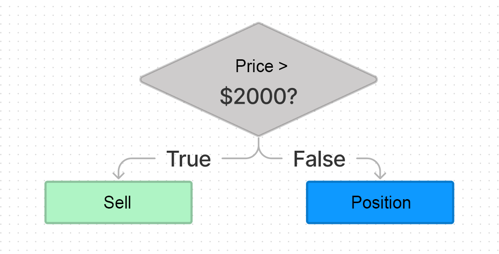

# WTF JavaScript minimalist tutorial: 6. Conditional statements

WTF JavaScript tutorial helps newcomers get started with JavaScript quickly.

**Twitter**: [@WTFAcademy\_](https://twitter.com/WTFAcademy_) | [@0xAA_Science](https://twitter.com/0xAA_Science)

**WTF Academy Community:** [Official website wtf.academy](https://wtf.academy/) | [WTF Solidity Tutorial](https://github.com/AmazingAng/WTFSolidity) | [discord](https ://discord.gg/5akcruXrsk/) | [WeChat group application](https://docs.google.com/forms/d/e/1FAIpQLSe4KGT8Sh6sJ7hedQRuIYirOoZK_85miz3dw7vA1-YjodgJ-A/viewform?usp=sf_link)

All codes and tutorials are open source on github: [github.com/WTFAcademy/WTF-JavaScript](https://github.com/WTFAcademy/WTF-JavaScript)

---

In investing, we often adopt different strategies based on different prices. In this lecture, we introduce conditional statements in JavaScript, which allow us to perform different operations based on different conditions.



## if statement

The basic structure of the `if` statement is as follows:

```js
if (condition) {
   statement
}
```

When the condition of the `if` statement is `true`, the corresponding code block will be executed. For example:

```js
let x = 1;
if (x > 0) {
   x = x + 1;
}
console.log(x); // 2
```

The `if` statement evaluates the expression within the parentheses and converts the result to a Boolean type. The following values ​​will be evaluated as `false`:

- `false`
- `undefined`
- `null`
- `0`
- `NaN`
- Empty string (`""`)

All other values, including all objects, will evaluate to `true` when passed to an `if` statement

## if-else statement

The `if` code block can also be followed by an `else` code block. If the judgment condition is not true, the code inside it will be executed.

```js
let y = 1;
if (y != 1) {
   y = y + 1;
} else {
   y = y - 1;
}
console.log(y); // 0
```

## else-if statement

Sometimes we need to make multiple judgments, which can be achieved by using the `else-if` statement:

```js
const z = 2;

if (z === 0) {
   console.log('x value is 0');
} else if (z === 1) {
   console.log('x value is 1');
} else if (z === 2) {
   console.log('x value is 2');
} else {
   console.log('x is other value');
}
```

## Ternary operator

The ternary operator, also known as the conditional operator, is the only operator in JavaScript that uses three operands. Usage rules: `condition ? expression1 : expression2`. When the condition is true, `expression1` is executed, otherwise `expression2` is executed. This operator is often used as a shorthand form of an `if-else` statement. For example:

```js
// Return the larger number between x and z
const bigger = x < z ? z : x;
console.log(bigger);
```

## Exercises

Complete the following `isOdd` function to complete the logic: when the input parameter `num` is an odd number, it returns `true`, and when it is an even number, it returns `false`.

> Tip: You can use the remainder operator `%` to calculate the remainder of `num` and 2. If it is 0, it is an even number; if it is 1, it is an odd number.

```js
function isOdd(num){
}
```

## Summary

In this lecture, we introduced JavaScript’s conditional statements, including `if`, `if-else`, `else-if`, and the ternary operator. They can enrich the logic of the program.
