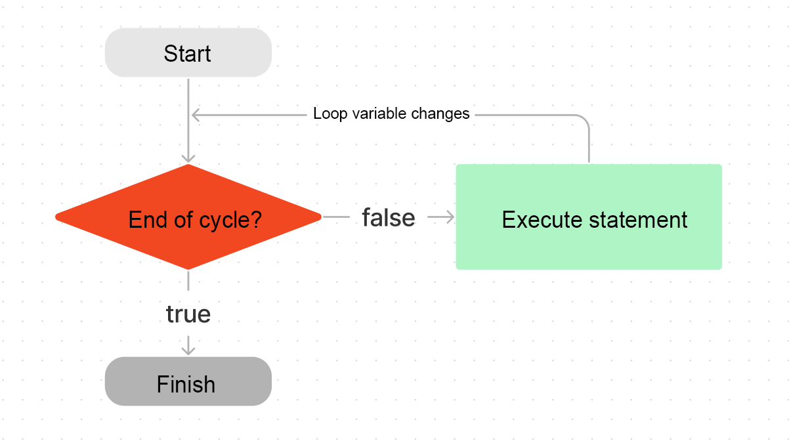
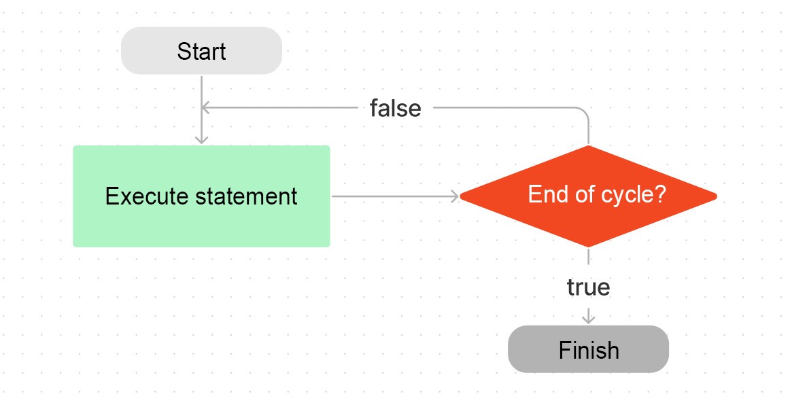

# WTF JavaScript Minimalist Tutorial: 7. Loop Statement

WTF JavaScript tutorial helps newcomers get started with JavaScript quickly.

**Twitter**: [@WTFAcademy\_](https://twitter.com/WTFAcademy_) | [@0xAA_Science](https://twitter.com/0xAA_Science)

**WTF Academy Community:** [Official website wtf.academy](https://wtf.academy/) | [WTF Solidity Tutorial](https://github.com/AmazingAng/WTFSolidity) | [discord](https ://discord.gg/5akcruXrsk/) | [WeChat group application](https://docs.google.com/forms/d/e/1FAIpQLSe4KGT8Sh6sJ7hedQRuIYirOoZK_85miz3dw7vA1-YjodgJ-A/viewform?usp=sf_link)

All codes and tutorials are open source on github: [github.com/WTFAcademy/WTF-JavaScript](https://github.com/WTFAcademy/WTF-JavaScript)

---

We often need to perform some operations repeatedly, such as outputting the items in the list one by one. In this lecture, we will introduce the loop statement in JavaScript, which allows the program to perform certain operations repeatedly.


## for loop



The `for` loop is the most commonly used form of loop, which can specify the starting point, end point and termination conditions of the loop. Its basic structure is as follows:

```js
for (loop variable initialization; loop end condition; increment expression) {
   Execute statement
}
```

in

- Loop variable initialization: Initialize the loop counter. For example, we initialize a variable to record the number of loops `let i = 0`.
- Loop end condition: It is an expression used to determine whether to end the loop. At the beginning of each round of loop, the value of this conditional expression will be calculated. If it is `true`, the loop will continue; otherwise, the loop will stop. For example, let's loop ten times, that is, `i < 10`.
- Increment expression: The last operation performed in each round of the loop, usually used to update loop variables. Usually the loop variable is incremented by `i++`.
- Execution statement: Action repeated each time in the loop. For example, print out the current value of `i`.

Here is the code to print `i` in a loop:

```js
for (let i = 0; i < 10; i++) {
   console.log(`i current value is: ${i}`);
}

//The current value of i is: 0
//The current value of i is: 1
// ...
//The current value of i is: 9
```


## while loop


The `while` statement includes a loop condition and a code block. Each loop will first check the loop condition. If it is `true`, the code block will continue to be executed. Its basic structure is as follows:

```js
while (condition) {
   statement
}
```

Compared with the `for` loop, it does not have loop variables and their increment, which need to be defined by yourself in the statement. We rewrite the above example as a `while` loop:

```js
let i = 0
while (i < 10) {
   console.log(`i current value is: ${i}`)
   i++
}
```

## do-while loop



The `do-while` loop is similar to the `while` loop. The only difference is that the `do-while` loop will first execute the loop body, and then check the condition. When the condition is `true`, the loop body will be executed repeatedly. Its basic structure is as follows:

```js
do {
   statement
} while (condition)
```

The characteristic of this structure is that regardless of whether the condition is true or not, the loop body is executed at least once. Change the previous example of printing `i` in the `while` loop into a `do-while` loop as follows:

```js
let i = 0
do {
   console.log(`i current value is: ${i}`);
   i++;
} while (i < 9)
```

> Think about why the condition here is `i < 9` instead of `i < 10`? What happens to the result if we change it to `i < 10`?

## break statement

The `break` statement is used to break out of a code block or loop.

The following example will only execute the loop twice. When `i` is equal to 2, it will break out of the loop:

```js
for (let i = 0; i < 3; i++) {
   console.log(`i current value is: ${i}`);
   if (i === 2) break;
}

//The current value of i is: 0
//The current value of i is: 1
//The current value of i is: 2
```

## continue statement

The `continue` statement is also used to break out of a loop. Unlike the `break` statement, it does not terminate the entire loop, but only terminates the current cycle, and then returns to the head of the loop structure to start the next cycle.

The following code will print odd numbers up to 10:

```js
for (let i = 0; i < 10; i++) {
   if (i % 2 === 0) continue
   console.log(`i current value is: ${i}`)
}
//The current value of i is: 1
//The current value of i is: 3
//The current value of i is: 5
//The current value of i is: 7
//The current value of i is: 9
```

## Exercises

Complete the `sum` function below to complete the logic: Return the sum of all numbers from 1 to the positive integer `num`. For example, when `num` is 5, 15 is returned.

```js
function sum(num) {
  
}

console.log(sum(5)) // should return 15
console.log(sum(9)) // should return 45
```

## Summary

In this lecture, we introduced the loop statements in JavaScript, mainly introducing the two loop structures `for` and `while`, as well as the methods to jump out of the loop.
