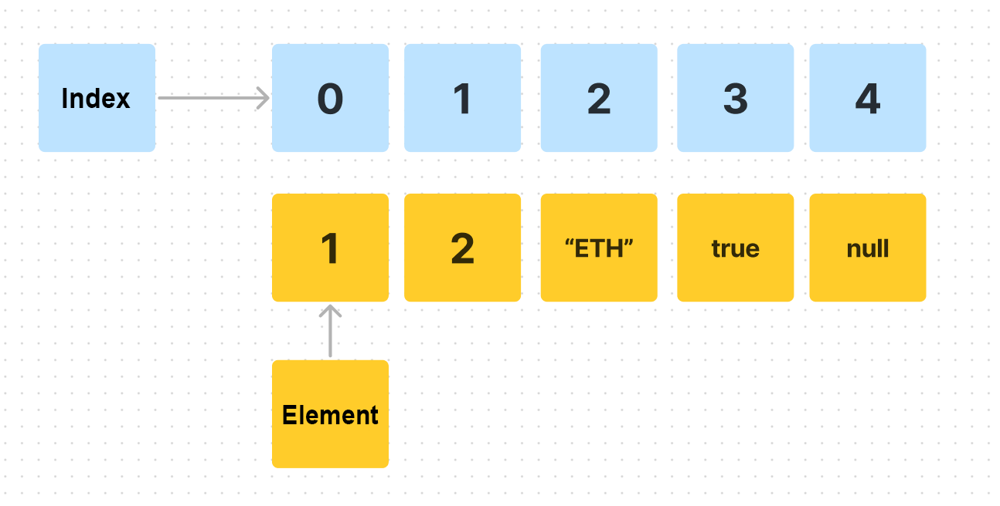

# WTF JavaScript Minimalist Tutorial: 8. Arrays

WTF JavaScript tutorial helps newcomers get started with JavaScript quickly.

**Twitter**: [@WTFAcademy_](https://twitter.com/WTFAcademy_) | [@0xAA_Science](https://twitter.com/0xAA_Science)

**WTF Academy Community:** [Official website wtf.academy](https://wtf.academy/) | [WTF Solidity Tutorial](https://github.com/AmazingAng/WTFSolidity) | [discord](https ://discord.gg/5akcruXrsk/) | [WeChat group application](https://docs.google.com/forms/d/e/1FAIpQLSe4KGT8Sh6sJ7hedQRuIYirOoZK_85miz3dw7vA1-YjodgJ-A/viewform?usp=sf_link)

All codes and tutorials are open source on github: [github.com/WTFAcademy/WTF-Javascript](https://github.com/WTFAcademy/WTF-Javascript)

---

In this lecture, we will introduce the most common complex type in Javascript: array (Array). It can store multiple data together in an orderly manner.

## Definition

Array types support storing multiple elements under a single variable name. The simplest way to create an array is to use a comma-separated list inside a pair of square brackets `[]`, for example:

```js
// Empty array with no elements
const empty = [];
//Array to store three strings
const courses = ["Solidity", "Etherjs", "JavaScript"];
// Store arrays of different data types
const mix = [1,'WTF',true];
```

The elements in the array can be of basic type or another array. You can store more complex nested data through arrays. Below, the `complex` array contains the `courses` and `mix` arrays:

```js
// complex is an array containing two elements, each element is another array
const complex = [courses, mix];
const nested = [[1, 2], [1, 1, 1]];
```

## Read and write arrays



### Read

We can use indexing (brackets `[]`) on variables to read array elements. Note that array indexing starts at 0:

```js
const arr = [1,2,3,["Solidity",true]]
//Read the 0th element
console.log(arr[0]) // 1
//Read the 0th element of the nested array
console.log(arr[3][0]) // "Solidity"
```

### Write

You can modify an array by assigning a value to an element using an index:

```js
//Modify the first element of the array
arr[1] = 6
console.log(arr) //[1, 6, 3, Array(2)]
```

Array variables also have some properties that can be read. For example, the `length` property returns the length of the array:

```js
//Output array length
console.log(arr.length) // 4
```

## Traverse the array

An array stores multiple data, and we can use a loop to traverse all elements inside the array. In the following example, we use a for loop to calculate the average of the `numArr` array.

```js
const numArr = [5, 8, 9, 11, 55];
let average = 0;
for(let i = 0; i < numArr.length; i++){
   average += numArr[i] / numArr.length
}
console.log(`average is: ${average}`) // 17.6
```

## Add and delete

There are many methods built into the array, among which `push` and `pop` are used to add and delete elements.

### push


In the array, we can use the `push` method to `push` (add) an element at the end of the array. This method will increase the length of the array by one.

```js
const nums = [1,2,3]
nums.push(4)
console.log(nums) // [1, 2, 3, 4]
```

### pop


We can `pop` an element from the end of an array using the `pop` method. This method decrements the length of the array by one and returns the popped element.

```js
// The pop method will return the popped element
const last = nums.pop()
console.log(last) // 4 pop up
console.log(nums) // [1, 2, 3]
```

For more array operation methods, please refer to [MDN Tutorial](https://developer.mozilla.org/zh-CN/docs/Web/JavaScript/Reference/Global_Objects/Array#%E5%AE%9E%E4%BE% 8B%E6%96%B9%E6%B3%95), you can focus on the `slice`, `splice`, `indexOf` methods.

## Exercises
Complete the `sumOdd` function below to complete the logic: Calculate the sum of all odd numbers in the input array `arr`.

```js
function sumOdd(arr){

}

console.log(sumOdd([1, 2, 3, 4, 5])) // should return 9
console.log(sumOdd([2, 4, 6, 8, 10])) // should return 30
console.log(sumOdd([1, 3, 5, 7, 9])) // should return 25
```

## Summary

In this lecture, we introduced arrays in Javascript, including array definition, reading, writing, and traversing. Arrays are data structures often used in daily development. We will continue to see them in subsequent tutorials, so be sure to master them well.
