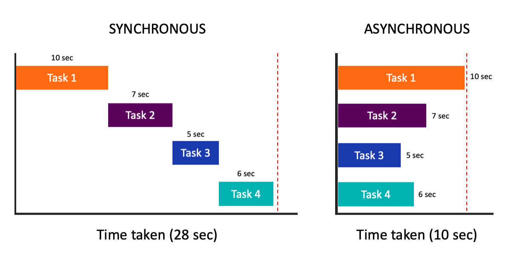
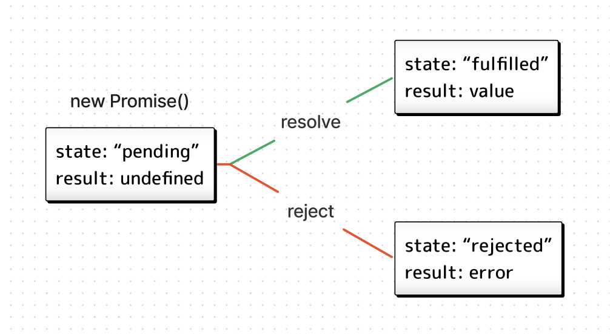

# WTF JavaScript Minimalist Tutorial: 10. Asynchronous

WTF JavaScript tutorial helps newcomers get started with JavaScript quickly.

**Twitter**: [@WTFAcademy\_](https://twitter.com/WTFAcademy_) | [@0xAA_Science](https://twitter.com/0xAA_Science)

**WTF Academy Community:** [Official website wtf.academy](https://wtf.academy/) | [WTF Solidity Tutorial](https://github.com/AmazingAng/WTFSolidity) | [discord](https ://discord.gg/5akcruXrsk/) | [WeChat group application](https://docs.google.com/forms/d/e/1FAIpQLSe4KGT8Sh6sJ7hedQRuIYirOoZK_85miz3dw7vA1-YjodgJ-A/viewform?usp=sf_link)

All codes and tutorials are open source on github: [github.com/WTFAcademy/WTF-JavaScript](https://github.com/WTFAcademy/WTF-JavaScript)

---

In this lecture, we introduce asynchronous in JavaScript, focusing on the `async/await` syntax.

## Asynchronous programming



JavaScript is a single-threaded programming language, and the browser executes the program line by line in the order of our code. If a task that takes a long time is executed, subsequent tasks will be blocked, delaying the execution of the entire program. Asynchronous programming technology allows us to execute a long-term task, the program does not need to wait, but continues to execute the subsequent code until the task is completed and then comes back to notify. This greatly improves the efficiency of the program, especially for programs with intensive input and output, such as file reading, database query, and network access.

### Callback

In JavaScript, functions are also objects that can be passed as parameters to another function, which is also called a callback function. It used to be the primary way to implement asynchronous functions in JavaScript. The following is a classic example. We define a `callback()` function and pass it as a parameter to the `setTimeout()` timer function:

```js
function callback() {
   console.log('Hello, JavaScript!');
}

setTimeout(callback, 1000);
console.log('hello');
// hello
// Hello, JavaScript! (output after 1 second)
```

The above program will first output `hello`, then wait for 1 second before executing the `callback` function and output `"Hello, JavaScript!"`, even if the `setTimeout` function is before `console.log("hello")`. For a more detailed introduction to `setTimeout`, please read [MDN Tutorial](https://developer.mozilla.org/zh-CN/docs/Web/API/setTimeout).

However, if there are a large number of asynchronous tasks, this solution is prone to errors. The following is an example of using a callback function to maintain three asynchronous tasks:

```js
setTimeout(() => {
   console.log('Hello, WTF JavaScript!');
   setTimeout(() => {
     console.log('Hello, WTF HTML!');
     setTimeout(() => {
       console.log('Hello, WTF CSS!');
     }, 1000)
   }, 1000)
}, 1000)
```

This kind of code is extremely difficult to maintain, also known as "callback hell", and has been replaced by the `Promise` solution.

### Promise



`Promise` (promise) is a modern solution to asynchronous programming and is more powerful than the callback function solution. It was first proposed and implemented by the community. ES6 wrote it into the language standard and unified its usage, and natively provided the `Promise` object.

`Promise` objects have three states: `pending` (in progress), `fulfilled` (successful) and `rejected` (failed). The initial state is `pending`, and the final state is determined by the result of the asynchronous operation. There are only two possibilities for the state of a `Promise` object to change: from `pending` to `fulfilled` and from `pending` to `rejected`. Below we rewrite the first example using `Promise`:

```js
//Define promise instance
const promise = new Promise((resolve, reject) => {
   setTimeout(() => {
     resolve('Hello, JavaScript Promise!');
   }, 1000)
})
//Run the Promise instance
promise.then((value) => {
   console.log(value);
})
console.log('hello Promise');
// hello Promise
// Hello, JavaScript Promise! (output after 1 second)
```

Since `Promise` is relatively complex, we will explain it in detail in a later tutorial. In this lecture, we focus on the `async/await` syntax built on top of it.

## async/await

async/await is syntactic sugar for `Promise`, making asynchronous programming easier to understand and use.

### async function

We can add the `async` keyword in front of a function to turn it into an asynchronous function, and its return value will be automatically wrapped as a `Promise`. Unlike ordinary functions, asynchronous functions do not block the running of the program, allowing the JavaScript engine to handle other tasks at the same time: executing other scripts, processing events, etc.

```js
async function hello() {
   return new Promise((resolve, reject) => {
     setTimeout(() => {
       resolve('Hello, JavaScript async!');
     }, 1000)
   })
}
```

### await keyword

The `await` keyword can only work within the `async` function. Generally, `await` is followed by a `Promise` object, which is used to let the JavaScript engine wait until the `Promise` is completed and returns the result.

```js
async function helloAwait() {
   const value = await hello();
   console.log(value);
   console.log('hello await');
}
helloAwait()
// Hello, JavaScript async! (output after 1 second)
// hello await
```

Note that the above code will wait for 1 second before outputting `Hello async`, and then `hello await`.

### async/await example


Below, we demonstrate how to use `async/await` syntax to read the metadata of the very popular Boring Ape (BAYC) NFT.

1. NFT metadata is a set of data that constitutes NFT content, usually saved on the network in [JSON](https://zh.wikipedia.org/wiki/JSON) format. For example, the [ipfs](https://gateway.ipfscdn.io/ipfs/QmeSjSinHpPnmXmspMjwiXyN6zS4E9zccariGR3jxcaWtq/1) link in the `url` below saves the BAYC metadata of `id = 1`, including the small picture URL and attributes (mouth, hair , clothing and other characteristics).

   ```js
   const url = `https://ipfs.io/ipfs/QmeSjSinHpPnmXmspMjwiXyN6zS4E9zccariGR3jxcaWtq/1`;
   // data format
   // {"image":"ipfs://QmPbxeGcXhYQQNgsC6a36dDyYUcHgMLnGKnF8pVFmGsvqi","attributes":[{"trait_type":"Mouth","value":"Grin"},{"trait_type":"Clothes","value" :"Vietnam Jacket"},{"trait_type":"Background","value":"Orange"},{"trait_type":"Eyes","value":"Blue Beams"},{"trait_type":" Fur","value":"Robot"}]}
   ```

2. You can use the `fetch()` function to perform HTTP access and obtain network data. It returns an HTTP response wrapped in a `Promise`, so you need to use the `await` keyword to get the resulting `response`. Then, you need to use the `json()` method to get the content of the JSON, which is the metadata.

   ```js
   const response = await fetch(url);
   const BaycMetadata = await response.json();
   ```

3. Combine the above code into an `async` function `getBaycMetadata`:

```js
// async/await example
async function getBaycMetadata(){
   const url = `https://ipfs.io/ipfs/QmeSjSinHpPnmXmspMjwiXyN6zS4E9zccariGR3jxcaWtq/1`;
   const response = await fetch(url);
   const BaycMetadata = await response.json();
   console.log(BaycMetadata);
}
getBaycMetadata()
// image: "ipfs://QmPbxeGcXhYQQNgsC6a36dDyYUcHgMLnGKnF8pVFmGsvqi"
// attributes...
```

## Exercises

Based on the example in this lecture, write a method to obtain the metadata of the corresponding boring ape based on the tokenId (1~10000) entered by the user.

> Tip: The last digit of the URL in the example represents tokenId, which can be replaced with `{$tokenId}`.

```jsx live
function getBaycMetadataById(tokenId) {
  
}
```

## Summary

In this lecture, we introduced asynchronous programming in JavaScript, including callback functions, Promise, and the emphasis on async/await, and used it to obtain the metadata of Boring Monk NFT. Promises are the foundation of modern JavaScript asynchronous programming. It avoids deeply nested callbacks and makes it easier to express and understand sequences of asynchronous operations. async/await makes it easier to build an operation from a series of consecutive asynchronous function calls, avoids the creation of explicit Promise chains, and allows you to write synchronous code as well as asynchronous code.
