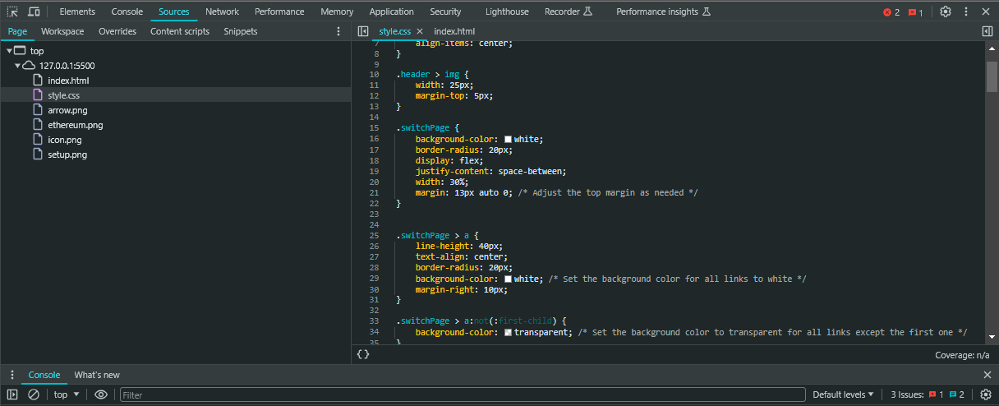

# WTF JavaScript minimalist tutorial 18. Exception handling

WTF JavaScript tutorial helps newcomers get started with JavaScript quickly.

**Twitter**: [@WTFAcademy_](https://twitter.com/WTFAcademy_) | [@0xAA_Science](https://twitter.com/0xAA_Science)

**WTF Academy Community:** [Official website wtf.academy](https://wtf.academy/) | [WTF Solidity Tutorial](https://github.com/AmazingAng/WTFSolidity) | [discord](https ://discord.gg/5akcruXrsk/) | [WeChat group application](https://docs.google.com/forms/d/e/1FAIpQLSe4KGT8Sh6sJ7hedQRuIYirOoZK_85miz3dw7vA1-YjodgJ-A/viewform?usp=sf_link)

All codes and tutorials are open source on github: [github.com/WTFAcademy/WTF-Javascript](https://github.com/WTFAcademy/WTF-Javascript)

---

In JavaScript programming, error handling and debugging are essential skills. No matter how perfectly your code is written, errors are inevitable. JavaScript provides a complete error handling mechanism through which we can handle runtime errors. In this chapter, we will introduce the error handling mechanism in JavaScript and how to use the browser's developer tools to debug the program.

## JavaScript error object

JavaScript has a special object type called `Error`, which is used to represent errors that occur during program execution. When the JavaScript engine encounters an error, it throws an `Error` object.

The `Error` object contains two main properties: `name` and `message`. The `name` attribute represents the name of the error, and the `message` attribute contains the error details.

The syntax for creating an `Error` object is as follows:

```javascript
let error = new Error("This is an error message");
console.log(error.name); // "Error"
console.log(error.message); // "This is an error message"
```

## Throw an error

In JavaScript, we can use the `throw` keyword to manually throw an error. When we throw an error, the execution of the program stops immediately and the JavaScript engine looks for code to handle the error. If no error handling code is found, the program stops executing entirely.

```javascript
throw new Error("This is an error message");
console.log("This will not be logged"); // This line of code will not be executed
```

## Catching errors

JavaScript provides the `try...catch` statement to catch and handle errors. When an error occurs in the code in the `try` block, the control flow will immediately jump to the corresponding `catch` block.

```javascript
try {
   // Code that may throw errors
   const a = 1
   a() // A TypeError will be thrown here
} catch (error) {
   // Handle errors
   console.log(error.message) // Output 'a is not a function'
}
```

In this example, we threw an error in the `try` block and then caught and handled the error in the `catch` block.

## finally statement

The `try...catch` structure can also contain a `finally` block. Regardless of whether the code in the `try` block throws an error, the code in the `finally` block is always executed.

```javascript
try {
   // Code that may throw errors
   const a = 1
   a() // A TypeError will be thrown here
} catch (error) {
   // Handle errors
   console.log(error.message) // Output 'a is not a function'
} finally {
   // Regardless of whether an error is thrown, this will be executed
   console.log('Execution completed')
}
```

In the above example, the code in the `finally` block will always be executed regardless of whether the code in the `try` block throws an error.

## Debugging: Browser developer tools

Most browsers have built-in developer tools that you can use to debug your JavaScript code. Developer tools provide many powerful features, including breakpoints, single-stepping, viewing variable values, and more.

You can open the developer tools by following these steps:

### shortcut key
`F12` (notebook users use `Fn+F12`)

### Manually open

1. Open a browser.
2. Right-click on the web page and select "Inspect" or "Inspect Element."
3. Switch to the "Console" or "Sources" tab.

In the developer tools, you can view all JavaScript errors, including the error type, error information, and the location where the error occurred.



You can also set breakpoints anywhere in your code. When code execution reaches a breakpoint, it will pause and you can view the values ​​of variables or step through the code.

## Summary

In this tutorial, we cover error handling in JavaScript in detail, including how to create and throw errors, and how to catch and handle them. When we write JavaScript code, we should always consider error handling and write appropriate code to handle possible errors. In addition, we can also use the browser's developer tools to debug our code.
