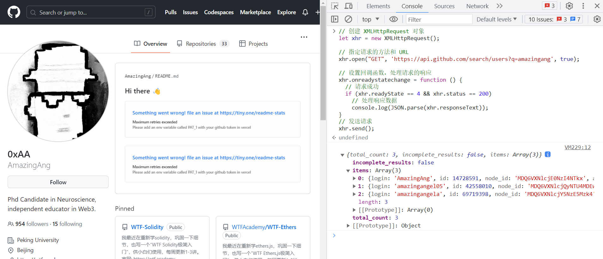
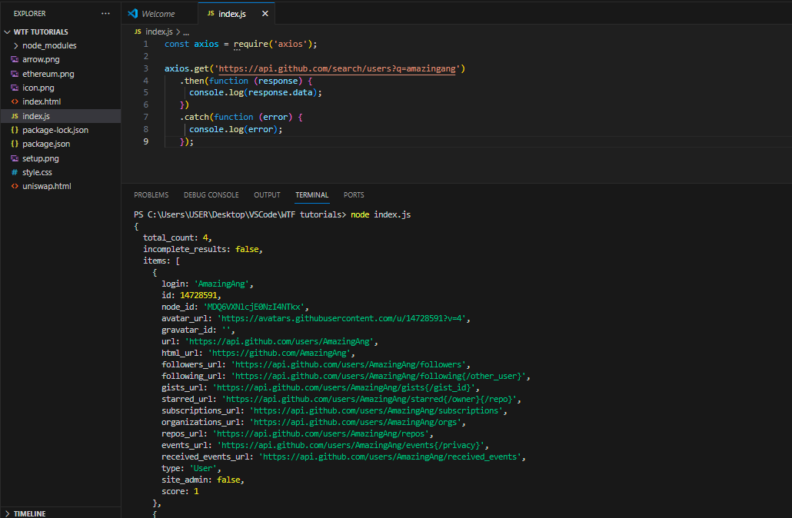

# WTF JavaScript Minimalist Tutorial 22. Network Request

WTF JavaScript tutorial helps newcomers get started with JavaScript quickly.

**Twitter**: [@WTFAcademy_](https://twitter.com/WTFAcademy_) | [@0xAA_Science](https://twitter.com/0xAA_Science)

**WTF Academy Community:** [Official website wtf.academy](https://wtf.academy/) | [WTF Solidity Tutorial](https://github.com/AmazingAng/WTFSolidity) | [discord](https ://discord.gg/5akcruXrsk/) | [WeChat Group Application](https://docs.google.com/forms/d/e/1FAIpQLSe4KGT8Sh6sJ7hedQRuIYirOoZK_85miz3dw7vA1-YjodgJ-A/viewform?usp=sf_link)

All codes and tutorials are open source on github: [github.com/WTFAcademy/WTF-Javascript](https://github.com/WTFAcademy/WTF-Javascript)

---

In this chapter, we will discuss how to make network requests using JavaScript. Focuses on GET and POST requests, and explains how to send these requests using AJAX, the Fetch API, and axios.

## GET request

GET requests are the most common type of HTTP requests and are typically used to obtain data on the server.

In JavaScript, you can use the `fetch` function to send a GET request, as shown in the following example:

```javascript
fetch('https://api.github.com/search/users?q=amazingang', {
   method: 'GET',
})
.then(response => response.json())
.then(data => console.log(data))
.catch((error) => console.error('Error:', error));
```

In the above code, we use the `fetch` function to send a GET request to the URL `https://api.github.com/search/users?q=amazingang`. We then use `.then` to process the returned response and convert it to JSON format. Finally, we print out the returned data or catch and print out any errors.

## POST request

POST requests are used to send data to the server. This request type is typically used for form submissions.

Sending a POST request is similar to sending a GET request, but you need to provide some additional options in the second parameter of the `fetch` function. Specifically, we need to set the `method` to `'POST'` and provide a `body` that contains the data we want to send.

Here is an example:

```javascript
fetch('https://api.example.com/data', {
   method: 'POST',
   headers: {
     'Content-Type': 'application/json',
   },
   body: JSON.stringify({
     username: '0xAA',
     password: 'pwd',
   }),
})
.then(response => response.json())
.then(data => console.log(data))
.catch((error) => console.error('Request failure:', error));
```

In the above code, we send a POST request to the same URL, but this time we include a request body that contains JSON data for the `username` and `password` fields. Note that we also set the `Content-Type` header to `application/json` to tell the server that we are sending JSON data.

## AJAX

AJAX (Asynchronous JavaScript and XML) is a technology that exchanges data with the server and updates parts of the web page without refreshing the entire page. AJAX is not a new programming syntax, but a new way of putting it together using existing standards, such as the XMLHttpRequest object.

Here is an AJAX example:

```javascript
//Create XMLHttpRequest object
let xhr = new XMLHttpRequest();

//Specify the request method and URL
xhr.open("GET", 'https://api.github.com/search/users?q=amazingang', true);

//Set the callback function to handle the response to the request
xhr.onreadystatechange = function () {
   // Request successful
   if (xhr.readyState == 4 && xhr.status == 200)
     // Process response data
     console.log(JSON.parse(xhr.responseText));
}
// send request
xhr.send();
```

Executing the above code in the browser console will print out the github users whose names contain `amazingang`



## Fetch API

The Fetch API provides a simple, logical way to asynchronously fetch resources across a network. It is more powerful and flexible than the old XMLHttpRequest interface. The Fetch API returns a Promise object that represents the eventual completion (or failure) of an asynchronous operation and the value of its result.

Here is an example of the Fetch API:

```javascript
fetch('https://api.github.com/search/users?q=amazingang')
   .then(response => response.json())
   .then(data => console.log(data))
   .catch(error => console.error('Error:', error));
```


## Axios

Axios is a Promise-based HTTP library that can be used in browsers and node.js. The main features of Axios include: it can intercept requests and responses, convert request and response data, cancel requests, automatically convert JSON data, and the client supports defense against XSRF, etc.

Here is an example of axios:

```javascript
const axios = require('axios');

axios.get('https://api.github.com/search/users?q=amazingang')
   .then(function (response) {
     console.log(response.data);
   })
   .catch(function (error) {
     console.log(error);
   });
```



## Summary

The above is a brief introduction to AJAX, Fetch API and axios. In actual development, you can choose the most suitable technology for network requests based on your needs and scenarios.
