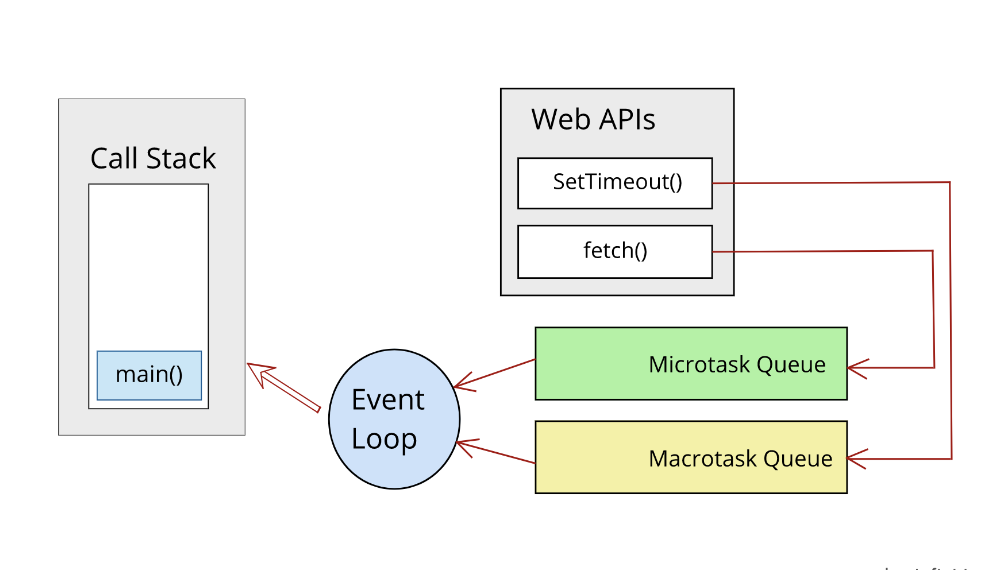

# WTF JavaScript Minimalist Tutorial 23. Event Loop

WTF JavaScript tutorial helps newcomers get started with JavaScript quickly.

**Twitter**: [@WTFAcademy_](https://twitter.com/WTFAcademy_) | [@0xAA_Science](https://twitter.com/0xAA_Science)

**WTF Academy Community:** [Official website wtf.academy](https://wtf.academy/) | [WTF Solidity Tutorial](https://github.com/AmazingAng/WTFSolidity) | [discord](https ://discord.gg/5akcruXrsk/) | [WeChat group application](https://docs.google.com/forms/d/e/1FAIpQLSe4KGT8Sh6sJ7hedQRuIYirOoZK_85miz3dw7vA1-YjodgJ-A/viewform?usp=sf_link)

All codes and tutorials are open source on github: [github.com/WTFAcademy/WTF-Javascript](https://github.com/WTFAcademy/WTF-Javascript)

---

Although JavaScript is a single-threaded programming language, it can handle concurrent operations through the event loop mechanism, allowing JavaScript to perform asynchronous processing. JavaScript divides code into synchronous tasks and asynchronous tasks. Through the event loop, asynchronous tasks will not block the main thread while waiting (such as network requests) and can perform other tasks at the same time.

## Call stack and task queue

Before we delve into the event loop, we need to understand the following two concepts:

- **Call Stack**: JavaScript has only one call stack, which is used to track the location of function calls when the code is executed. When a function is called, it is added to the top of the stack. When the function returns, it is removed from the stack. Synchronous tasks will enter the call stack directly.

- **Task Queue**: When asynchronous tasks (such as setTimeout or fetch) complete, their callback functions are added to the task queue. If the call stack is empty, the event loop moves these callback functions one by one into the call stack for execution.




## Macro tasks and micro tasks

In the JavaScript event loop mechanism, tasks are divided into two types: macro tasks and micro tasks.

- **Macrotask**: Tasks executed directly by the JavaScript engine thread, including the entire script (main script), setTimeout and setInterval callbacks, setImmediate (Node.js environment), etc.

- **Microtask (Microtask)**: Microtask is a task that is executed immediately after the current macro task ends, including Promise's then and catch callbacks, process.nextTick (Node.js environment), MutationObserver's callback (browser environment) etc.

## Event loop process

The process of the event loop can be simplified to the following

A few steps:

1. Take out a task from the macro task queue and execute it.
2. After executing this task, execute all microtasks.
3. When the microtask queue is cleared, enter the next event loop and execute the next macrotask.

Let’s look at an example showing the execution sequence of macro tasks and micro tasks:

```javascript
console.log('script start'); // Macrotask

setTimeout(function() {
   console.log('setTimeout'); // Macrotask
}, 0);

Promise.resolve().then(function() {
   console.log('promise1'); // Microtask
}).then(function() {
   console.log('promise2'); // Microtask
});

console.log('script end'); // Macrotask
```

The output sequence of the above code is:

```js
script start
script end
promise1
promise2
setTimeout
```

explain:
1. First, the code is executed to `console.log('script start')`, and "script start" is output.
2. Then, when `setTimeout` is encountered, push its callback function into the macro task queue.
3. Then, when encountering `Promise.resolve().then()`, push the first `then` callback function into the microtask queue.
4. Continue execution, encounter the second `then` callback function, and push it into the microtask queue.
5. Execute to `console.log('script end')` and output "script end".
6. After the execution of the current macro task (script main thread code) is completed, the event loop begins to process the microtask queue and execute the microtasks in sequence.
7. Execute the first microtask and output "promise1".
8. Execute the second microtask and output "promise2".
9. After the microtask is executed, the event loop starts processing the next macrotask.
10. Take out the callback function of `setTimeout` from the macro task queue and output "setTimeout".

It is recommended that you experience the visualization of the event loop on the [jsv9000](https://www.jsv9000.app/) website, so that you can understand the process of the event loop more intuitively.


## Summary

In this lecture, we take an in-depth look at the event loop in JavaScript, including macrotasks and microtasks. This is the basis for understanding JavaScript asynchronous programming and can help us better understand and control the execution sequence of the code.
